Proxy check
========================================================

Let's check the original proxy files against the resulting averaging/aggregating using our stage bins.

RED = Original
BLUE = Aggregated into Stagetime File

There will be some jiggling due to dates being a little different from file to file.


```r
library(scales)
# stageTime <- read.csv('../data/cleanProxiesByStage_20131203.csv')
stageTime <- read.csv("../data/cleanProxiesByStage_20131210.csv")


# check against Hannisdal and Peters
proxy <- read.csv("../data/Hannisdal and Peters data with stage IDs.csv", na.strings = "?")


for (prox in names(proxy)[14:17]) {
    plot(proxy$bottom, proxy[[prox]], pch = 19, col = alpha("red", 0.5), ylab = prox)
    matplot(stageTime$Start..Ma., stageTime[[prox]], pch = 19, col = alpha("blue", 
        0.5), add = T)
}
```

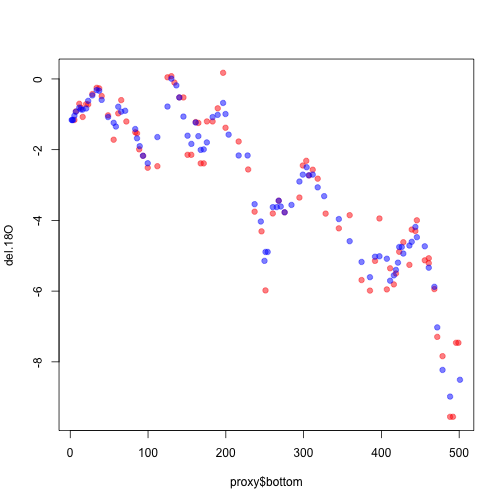 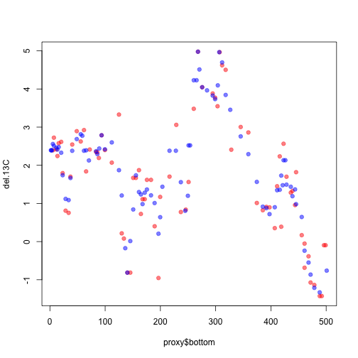 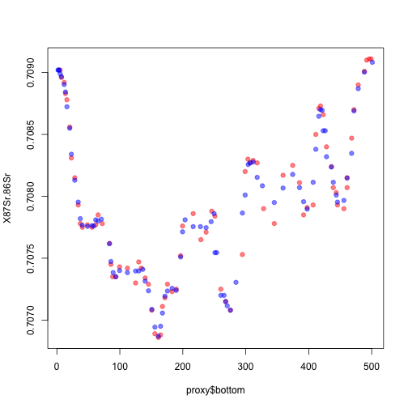 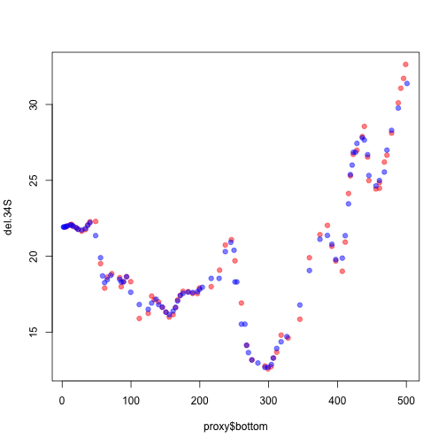 


H&P: Mostly good.

How about extinction rates?


```r
###### extinction rate
extMag <- read.csv("../data/Ext mag 3-15 Revised.csv")
extMag2 <- read.csv("../data/Biv BC ext PBDB 4-17-12.csv")

names(extMag2)[6] <- paste(names(extMag2)[6], "PBDB", sep = ".")

# add times
extMag$Base_bottom..Ma. <- c(0, extMag$Base..Ma.[-nrow(extMag)])
extMag2$Base_bottom..Ma. <- c(0, extMag2$Base..Ma.[-nrow(extMag2)])

plot(extMag$Base_bottom..Ma., extMag$BC.extinction.rate, pch = 19, col = alpha("red", 
    0.5), ylab = "Ext")
```

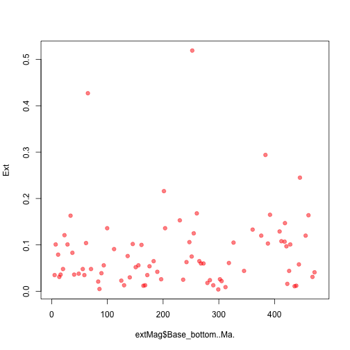 

```r
matplot(stageTime$Start..Ma., stageTime$BC.extinction.rate, pch = 19, col = alpha("blue", 
    0.5), add = T)
```

```
## Error: 'data' must be of a vector type, was 'NULL'
```

```r

######## PBDB
plot(extMag2$Base_bottom..Ma., extMag2$BC.extinction.rate.PBDB, pch = 19, col = alpha("red", 
    0.5), ylab = "Ext")

matplot(stageTime$Start..Ma., stageTime$BC.extinction.ratePBDB, pch = 19, col = alpha("blue", 
    0.5), add = T)
```

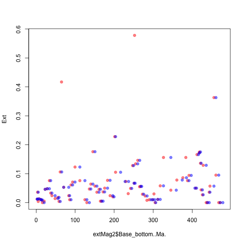 


Hrm.  The lack of peaks in the aggregated files is a bit troubling.  Worth digging into, or do we think this is OK?

The nearer point - the Maastrictian - is of a different length in the stageTime file, and thus encompasses other extinction rates, which lowers the point.
The further unmatched point - the Changhsingian in the PBDB extinction rate file - is also wider in the stageTime file, and thus is a lower extinction rate.


On to sealevel.


```r
######## sealevel
sealevel <- read.csv("../data/Sea level residuals after 2nd-order polynomial fit.csv")

for (prox in names(sealevel)[10:11]) {
    plot(sealevel$Time..my., sealevel[[prox]], pch = 19, col = alpha("red", 
        0.5), ylab = prox)
    matplot(stageTime$Start..Ma., stageTime[[prox]], pch = 19, col = alpha("blue", 
        0.5), add = T)
}
```

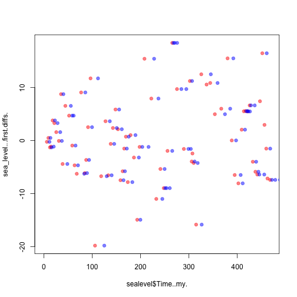 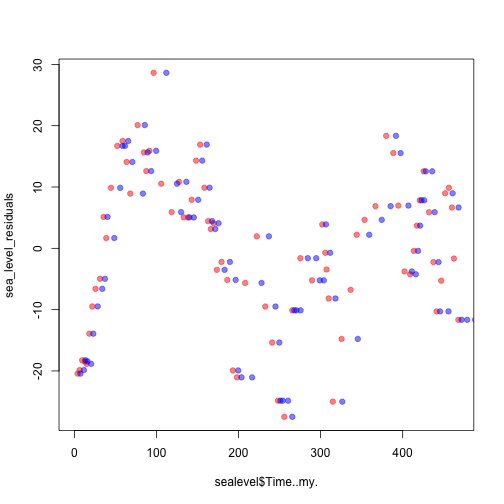 


The sealevel data syncs just fine.

Onto the Prokoph proxies.

```r

proxyProk <- read.csv("../data/Prokoph_data_9.2013.csv")
proxyProk <- subset(proxyProk, proxyProk$data_subset == "tropical no benthics")
names(proxyProk)[6:17] <- paste(names(proxyProk)[6:17], "prok", sep = ".")

for (prox in names(proxyProk)[6:17]) {
    plot(proxyProk$Binned_bottom, proxyProk[[prox]], pch = 19, col = alpha("red", 
        0.5), ylab = prox)
    matplot(stageTime$Start..Ma., stageTime[[prox]], pch = 19, col = alpha("blue", 
        0.5), add = T)
}
```

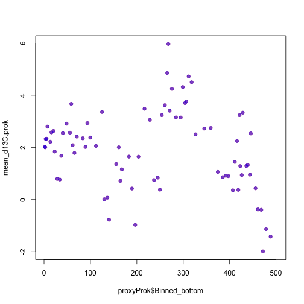 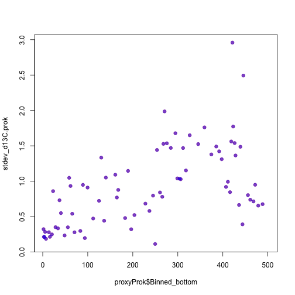 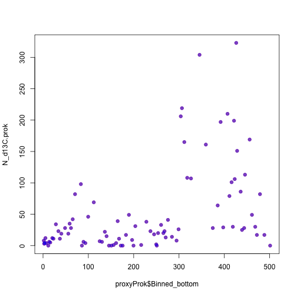 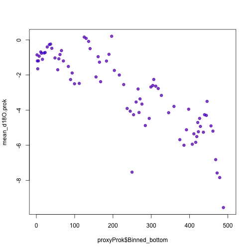 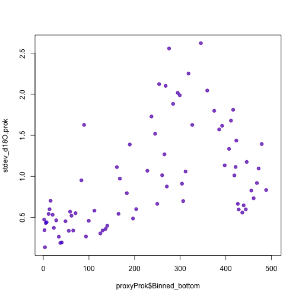 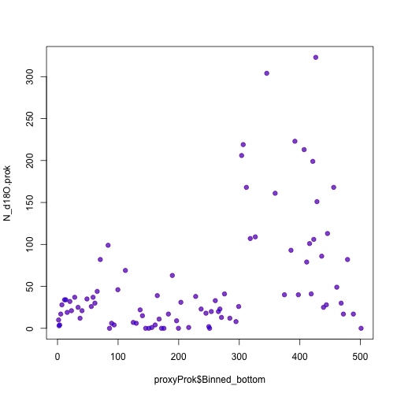 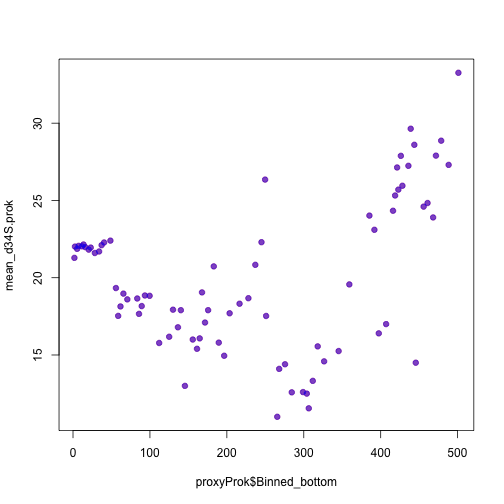 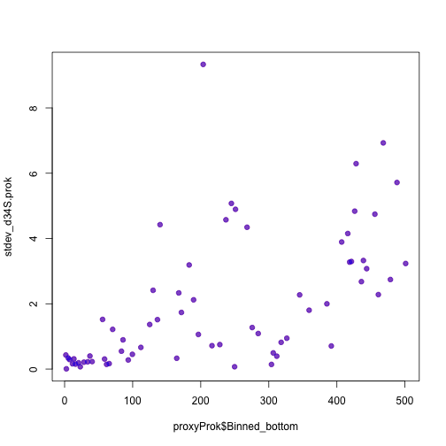 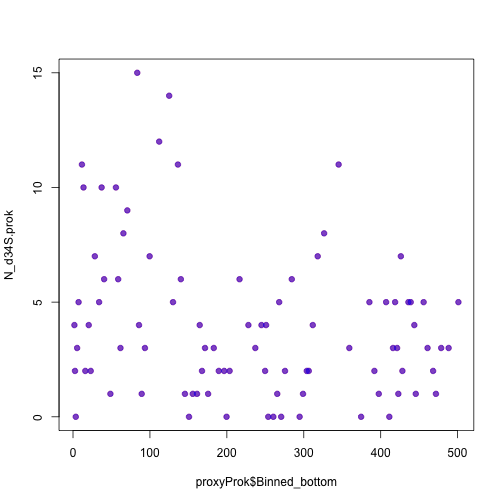 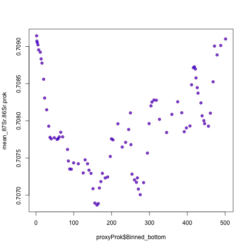 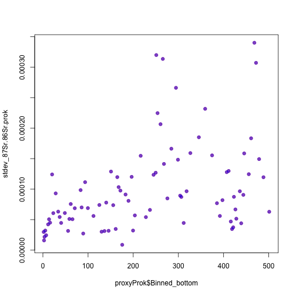 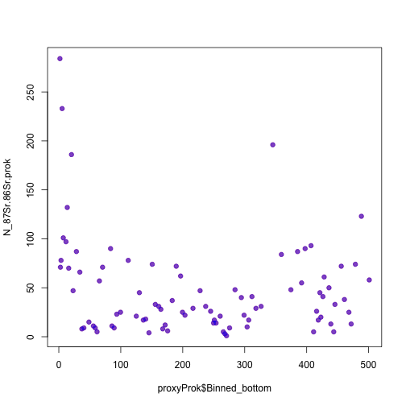 


We're so on here that the points are PURPLE.  That's because the Prokoph data uses stage names.

Last, sealevel variables

```r
sealevel <- read.csv("../data/Sea level residuals after 2nd-order polynomial fit.csv")

for (prox in names(sealevel)[2:11]) {
    plot(sealevel$Time..my., sealevel[[prox]], pch = 19, col = alpha("red", 
        0.5), ylab = prox)
    matplot(stageTime$Start..Ma., stageTime[[prox]], pch = 19, col = alpha("blue", 
        0.5), add = T)
}
```

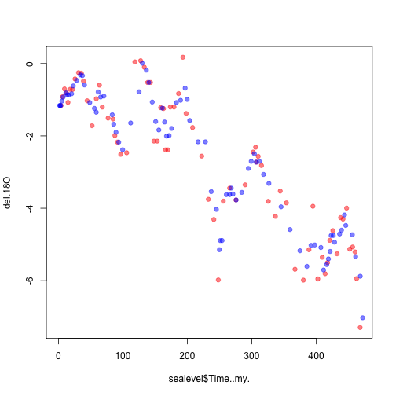 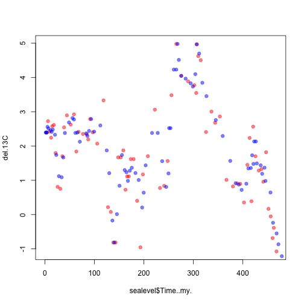 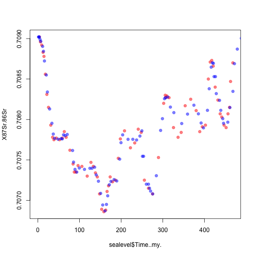 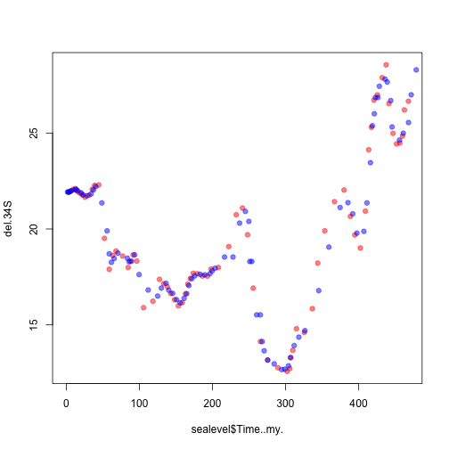 

```
## Error: 'data' must be of a vector type, was 'NULL'
```

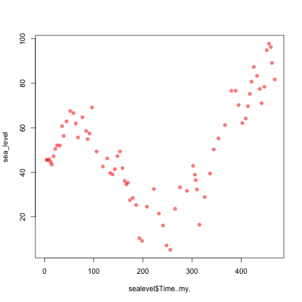 

