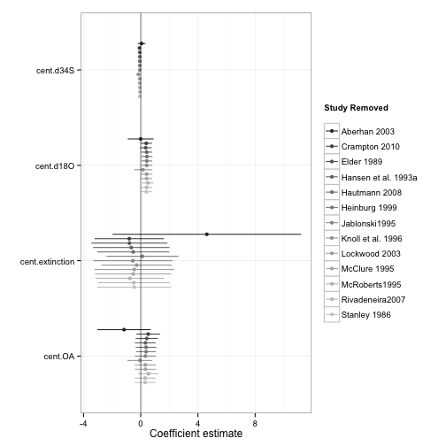

RMA Outputs
========================================================
  
  Here we go...


Broad v. Narrow Baseline
========================================================

First, we have to verify our assumptions about pooling all of the data.

Does grouping matter?

```r
taxGenera.Broad <- rma(yi = lnorReg, vi = vlnorReg, mods = ~Bivalve..Gastropod + 
    Tax.level, data = broadData)
taxGenera.Broad
```

```
## 
## Mixed-Effects Model (k = 80; tau^2 estimator: REML)
## 
## tau^2 (estimated amount of residual heterogeneity):     0.4671 (SE = 0.1465)
## tau (square root of estimated tau^2 value):             0.6834
## I^2 (residual heterogeneity / unaccounted variability): 56.53%
## H^2 (unaccounted variability / sampling variability):   2.30
## R^2 (amount of heterogeneity accounted for):            0.00%
## 
## Test for Residual Heterogeneity: 
## QE(df = 77) = 175.9544, p-val < .0001
## 
## Test of Moderators (coefficient(s) 2,3): 
## QM(df = 2) = 0.8493, p-val = 0.6540
## 
## Model Results:
## 
##                              estimate      se     zval    pval    ci.lb
## intrcpt                        1.0821  0.1866   5.7990  <.0001   0.7164
## Bivalve..GastropodGastropod    0.1284  0.2346   0.5474  0.5841  -0.3314
## Tax.levelSpecies              -0.1747  0.2261  -0.7726  0.4398  -0.6179
##                               ci.ub     
## intrcpt                      1.4478  ***
## Bivalve..GastropodGastropod  0.5883     
## Tax.levelSpecies             0.2685     
## 
## ---
## Signif. codes:  0 '***' 0.001 '**' 0.01 '*' 0.05 '.' 0.1 ' ' 1
```


Does Multistage matter?

```r
multStage.Broad <- rma(yi = lnorReg, vi = vlnorReg, mods = ~MultipleStages, 
    data = broadData)
multStage.Broad
```

```
## 
## Mixed-Effects Model (k = 80; tau^2 estimator: REML)
## 
## tau^2 (estimated amount of residual heterogeneity):     0.4736 (SE = 0.1465)
## tau (square root of estimated tau^2 value):             0.6882
## I^2 (residual heterogeneity / unaccounted variability): 57.07%
## H^2 (unaccounted variability / sampling variability):   2.33
## R^2 (amount of heterogeneity accounted for):            0.00%
## 
## Test for Residual Heterogeneity: 
## QE(df = 78) = 178.8792, p-val < .0001
## 
## Test of Moderators (coefficient(s) 2): 
## QM(df = 1) = 0.2376, p-val = 0.6260
## 
## Model Results:
## 
##                     estimate      se    zval    pval    ci.lb   ci.ub     
## intrcpt               0.9538  0.1864  5.1168  <.0001   0.5885  1.3192  ***
## MultipleStagesTRUE    0.1136  0.2332  0.4874  0.6260  -0.3433  0.5706     
## 
## ---
## Signif. codes:  0 '***' 0.001 '**' 0.01 '*' 0.05 '.' 0.1 ' ' 1
```


Does Global v. Regional matter?

```r
scale.Broad <- rma(yi = lnorReg, vi = vlnorReg, mods = ~Global.Regional, data = broadData)
scale.Broad
```

```
## 
## Mixed-Effects Model (k = 80; tau^2 estimator: REML)
## 
## tau^2 (estimated amount of residual heterogeneity):     0.4715 (SE = 0.1460)
## tau (square root of estimated tau^2 value):             0.6867
## I^2 (residual heterogeneity / unaccounted variability): 56.99%
## H^2 (unaccounted variability / sampling variability):   2.33
## R^2 (amount of heterogeneity accounted for):            0.00%
## 
## Test for Residual Heterogeneity: 
## QE(df = 78) = 178.5149, p-val < .0001
## 
## Test of Moderators (coefficient(s) 2): 
## QM(df = 1) = 0.1128, p-val = 0.7370
## 
## Model Results:
## 
##                   estimate      se    zval    pval    ci.lb   ci.ub     
## intrcpt             0.9973  0.1414  7.0545  <.0001   0.7202  1.2744  ***
## Global.Regional1    0.0776  0.2311  0.3358  0.7370  -0.3753  0.5306     
## 
## ---
## Signif. codes:  0 '***' 0.001 '**' 0.01 '*' 0.05 '.' 0.1 ' ' 1
```


Does Time Matter?

```r
time.Broad <- rma(yi = lnorReg, vi = meanDate, mods = ~meanDate, data = broadData)
time.Broad
```

```
## 
## Mixed-Effects Model (k = 80; tau^2 estimator: REML)
## 
## tau^2 (estimated amount of residual heterogeneity):     0 (SE = 1.0229)
## tau (square root of estimated tau^2 value):             0
## I^2 (residual heterogeneity / unaccounted variability): 0.00%
## H^2 (unaccounted variability / sampling variability):   1.00
## R^2 (amount of heterogeneity accounted for):            NA%
## 
## Test for Residual Heterogeneity: 
## QE(df = 78) = 5.4666, p-val = 1.0000
## 
## Test of Moderators (coefficient(s) 2): 
## QM(df = 1) = 0.0046, p-val = 0.9459
## 
## Model Results:
## 
##           estimate      se    zval    pval    ci.lb   ci.ub   
## intrcpt     0.9614  0.4576  2.1011  0.0356   0.0646  1.8583  *
## meanDate    0.0006  0.0092  0.0679  0.9459  -0.0174  0.0187   
## 
## ---
## Signif. codes:  0 '***' 0.001 '**' 0.01 '*' 0.05 '.' 0.1 ' ' 1
```


If we pool everything, what is our grand mean Log Odds Ratio for Broad v. Narrow?

```r
broad.rma <- rma(yi = lnorReg, vi = vlnorReg, data = broadData)
broad.rma
```

```
## 
## Random-Effects Model (k = 80; tau^2 estimator: REML)
## 
## tau^2 (estimated amount of total heterogeneity): 0.4587 (SE = 0.1422)
## tau (square root of estimated tau^2 value):      0.6773
## I^2 (total heterogeneity / total variability):   56.63%
## H^2 (total variability / sampling variability):  2.31
## 
## Test for Heterogeneity: 
## Q(df = 79) = 178.8793, p-val < .0001
## 
## Model Results:
## 
## estimate       se     zval     pval    ci.lb    ci.ub          
##   1.0255   0.1110   9.2425   <.0001   0.8080   1.2430      *** 
## 
## ---
## Signif. codes:  0 '***' 0.001 '**' 0.01 '*' 0.05 '.' 0.1 ' ' 1
```

```r

####### Fig 1
```


Figure 1
========================================================

```r
pdf("figure/broad_narrow_rma.pdf", width = 3.7, height = 7.5)
plot_effect_sizes(broadData, rma.model = broad.rma, lab = c("narrow", "broad"))
dev.off()
```

```
## pdf 
##   2
```

```r
plot_effect_sizes(broadData, rma.model = broad.rma, lab = c("narrow", "broad"))
```

 


Epifauna v. Infauna Baseline
========================================================
  
Are Bivalves or Gastropods Different?

```r
bivalve.gastro.Epifaunal <- rma(yi = lnorReg, vi = vlnorReg, data = habitData, 
    mod = ~Bivalve..Gastropod - 1)
bivalve.gastro.Epifaunal
```

```
## 
## Mixed-Effects Model (k = 49; tau^2 estimator: REML)
## 
## tau^2 (estimated amount of residual heterogeneity):     0.4387 (SE = 0.1667)
## tau (square root of estimated tau^2 value):             0.6623
## I^2 (residual heterogeneity / unaccounted variability): 59.42%
## H^2 (unaccounted variability / sampling variability):   2.46
## 
## Test for Residual Heterogeneity: 
## QE(df = 47) = 118.6184, p-val < .0001
## 
## Test of Moderators (coefficient(s) 1,2): 
## QM(df = 2) = 0.8539, p-val = 0.6525
## 
## Model Results:
## 
##                              estimate      se     zval    pval    ci.lb
## Bivalve..GastropodBivalve     -0.1248  0.1468  -0.8507  0.3950  -0.4125
## Bivalve..GastropodGastropod    0.1098  0.3042   0.3609  0.7182  -0.4865
##                               ci.ub   
## Bivalve..GastropodBivalve    0.1628   
## Bivalve..GastropodGastropod  0.7061   
## 
## ---
## Signif. codes:  0 '***' 0.001 '**' 0.01 '*' 0.05 '.' 0.1 ' ' 1
```

```r

##### So, we pool.  Let's look at things, then
```

No - they are broadly the same.


Does global v. regional extinction matter?

```r
scale.habit <- rma(yi = lnorReg, vi = vlnorReg, mods = ~Global.Regional, data = habitData)
scale.habit
```

```
## 
## Mixed-Effects Model (k = 49; tau^2 estimator: REML)
## 
## tau^2 (estimated amount of residual heterogeneity):     0.4391 (SE = 0.1677)
## tau (square root of estimated tau^2 value):             0.6626
## I^2 (residual heterogeneity / unaccounted variability): 58.38%
## H^2 (unaccounted variability / sampling variability):   2.40
## R^2 (amount of heterogeneity accounted for):            0.00%
## 
## Test for Residual Heterogeneity: 
## QE(df = 47) = 119.4409, p-val < .0001
## 
## Test of Moderators (coefficient(s) 2): 
## QM(df = 1) = 1.9268, p-val = 0.1651
## 
## Model Results:
## 
##                   estimate      se     zval    pval    ci.lb   ci.ub   
## intrcpt            -0.0067  0.1425  -0.0473  0.9622  -0.2861  0.2726   
## Global.Regional1   -0.5303  0.3821  -1.3881  0.1651  -1.2791  0.2185   
## 
## ---
## Signif. codes:  0 '***' 0.001 '**' 0.01 '*' 0.05 '.' 0.1 ' ' 1
```


Does time matter?

```r
# SA 20130119: I changed bivalvesEpifaunal to habitatData. I believe this
# was just a mistake when copying the code over
time.Epifaunal <- rma(yi = lnorReg, vi = vlnorReg, data = habitData, mods = ~meanDate)
time.Epifaunal
```

```
## 
## Mixed-Effects Model (k = 49; tau^2 estimator: REML)
## 
## tau^2 (estimated amount of residual heterogeneity):     0.4289 (SE = 0.1648)
## tau (square root of estimated tau^2 value):             0.6549
## I^2 (residual heterogeneity / unaccounted variability): 58.69%
## H^2 (unaccounted variability / sampling variability):   2.42
## R^2 (amount of heterogeneity accounted for):            1.17%
## 
## Test for Residual Heterogeneity: 
## QE(df = 47) = 113.5364, p-val < .0001
## 
## Test of Moderators (coefficient(s) 2): 
## QM(df = 1) = 1.1641, p-val = 0.2806
## 
## Model Results:
## 
##           estimate      se     zval    pval    ci.lb   ci.ub   
## intrcpt    -0.2352  0.1940  -1.2122  0.2254  -0.6156  0.1451   
## meanDate    0.0032  0.0030   1.0789  0.2806  -0.0026  0.0091   
## 
## ---
## Signif. codes:  0 '***' 0.001 '**' 0.01 '*' 0.05 '.' 0.1 ' ' 1
```


If we pool everything, what is our grand mean Log Odds Ratio for Epifaunal v. Infaunal?

```r
meanModel.Epifaunal <- rma(yi = lnorReg, vi = vlnorReg, data = habitData)
meanModel.Epifaunal
```

```
## 
## Random-Effects Model (k = 49; tau^2 estimator: REML)
## 
## tau^2 (estimated amount of total heterogeneity): 0.4339 (SE = 0.1640)
## tau (square root of estimated tau^2 value):      0.6587
## I^2 (total heterogeneity / total variability):   59.09%
## H^2 (total variability / sampling variability):  2.44
## 
## Test for Heterogeneity: 
## Q(df = 48) = 119.9424, p-val < .0001
## 
## Model Results:
## 
## estimate       se     zval     pval    ci.lb    ci.ub          
##  -0.0808   0.1318  -0.6133   0.5397  -0.3391   0.1775          
## 
## ---
## Signif. codes:  0 '***' 0.001 '**' 0.01 '*' 0.05 '.' 0.1 ' ' 1
```


Figure 2
========================================================

```r
pdf("figure/inf_epi_rma.pdf", width = 3.7, height = 6)
plot_effect_sizes(habitData, meanModel.Epifaunal, lab = c("infauna", "epifauna"))
dev.off()
```

```
## pdf 
##   2
```

```r
plot_effect_sizes(habitData, meanModel.Epifaunal, lab = c("infauna", "epifauna"))
```

 

```r

# now fix up the labels (spacing and the et al.s)
```


Modeled Results
========================================================

Note, for both models, we fit using centered predictors. Doesn't make a difference to coefficient results, but by making the intercept 0, we get easier to interpret marginal plots
later on.

The Fitted Model for Broad v. Narrow

```r
broadDataExtinction <- broadData[which(!is.na(broadData$BC.extinction.ratePBDB)), 
    ]
broadDataExtinction <- broadDataExtinction[which(!is.na(broadDataExtinction$mean_d18O.prok)), 
    ]
broadDataExtinction <- broadDataExtinction[which(!is.na(broadDataExtinction$mean_d34S.prok)), 
    ]
broadDataExtinction <- broadDataExtinction[which(!is.na(broadDataExtinction$mean_d13C.prok)), 
    ]

# as we'll be using these predictors later
broadDataExtinction <- within(broadDataExtinction, {
    cent.extinction <- cent(BC.extinction.ratePBDB)
    cent.OA <- cent(OA)
    cent.d18O <- cent(mean_d18O.prok)
    cent.d34S <- cent(mean_d34S.prok)
    cent.d13C <- cent(mean_d13C.prok)
})

covModel.Broad.RMA <- rma(yi = lnorReg, vi = vlnorReg, data = broadDataExtinction, 
    mods = ~BC.extinction.ratePBDB + cent.OA + cent.d18O + cent.d34S + cent.d13C)

covModel.Broad.RMA
```

```
## 
## Mixed-Effects Model (k = 71; tau^2 estimator: REML)
## 
## tau^2 (estimated amount of residual heterogeneity):     0.2655 (SE = 0.1137)
## tau (square root of estimated tau^2 value):             0.5152
## I^2 (residual heterogeneity / unaccounted variability): 42.86%
## H^2 (unaccounted variability / sampling variability):   1.75
## R^2 (amount of heterogeneity accounted for):            2.53%
## 
## Test for Residual Heterogeneity: 
## QE(df = 65) = 112.8791, p-val = 0.0002
## 
## Test of Moderators (coefficient(s) 2,3,4,5,6): 
## QM(df = 5) = 4.7755, p-val = 0.4439
## 
## Model Results:
## 
##                         estimate      se     zval    pval    ci.lb   ci.ub
## intrcpt                   1.1255  0.1788   6.2930  <.0001   0.7749  1.4760
## BC.extinction.ratePBDB   -1.1950  2.7368  -0.4366  0.6624  -6.5591  4.1690
## cent.OA                   0.1735  0.2850   0.6088  0.5427  -0.3851  0.7321
## cent.d18O                -0.0018  0.0672  -0.0261  0.9792  -0.1335  0.1300
## cent.d34S                -0.0566  0.0343  -1.6499  0.0990  -0.1237  0.0106
## cent.d13C                -0.0783  0.1046  -0.7481  0.4544  -0.2833  0.1268
##                            
## intrcpt                 ***
## BC.extinction.ratePBDB     
## cent.OA                    
## cent.d18O                  
## cent.d34S                 .
## cent.d13C                  
## 
## ---
## Signif. codes:  0 '***' 0.001 '**' 0.01 '*' 0.05 '.' 0.1 ' ' 1
```

```r

write.csv(coef(covModel.Broad.RMA), "./broadCoefTable.csv", row.names = T)

broadCoefPlot <- coefPlot(covModel.Broad.RMA, robust = F, std = T) + coord_flip() + 
    scale_x_discrete(labels = c("Extinction Rate", expression(delta^13 * C), 
        expression(delta^18 * O), expression(delta^34 * S), "Acidification"), 
        expand = c(0.15, 0)) + annotate("text", x = 5, y = -0.5, label = "A)") + 
    ylim(c(-0.55, 0.4)) + annotate("text", x = 5.6, y = -0.35, label = "Favours\nnarrow") + 
    annotate("text", x = 5.6, y = 0.35, label = "Favours\nbroad")
```


The Fitted Model for Epifauna v. Infauna

```r
habitDataGood <- habitData[which(!(is.na(habitData$BC.extinction.ratePBDB))), 
    ]
habitDataGood <- habitDataGood[which(!(is.na(habitDataGood$lnorReg))), ]
habitDataGood <- habitDataGood[which(!(is.na(habitDataGood$mean_d18O.prok))), 
    ]
habitDataGood <- habitDataGood[which(!(is.na(habitDataGood$mean_d34S.prok))), 
    ]
habitDataGood <- habitDataGood[which(!(is.na(habitDataGood$vlnorReg))), ]
habitDataGood <- habitDataGood[which(!(is.na(habitDataGood$BC.extinction.ratePBDB))), 
    ]


# as we'll be using these predictors later
habitDataGood <- within(habitDataGood, {
    cent.extinction <- cent(BC.extinction.ratePBDB)
    cent.OA <- cent(OA)
    cent.d18O <- cent(mean_d18O.prok)
    cent.d34S <- cent(mean_d34S.prok)
    cent.meanDate <- cent(meanDate)
})

covModel.Epifaunal.rma <- rma(yi = lnorReg, vi = vlnorReg, data = habitDataGood, 
    mods = ~cent.OA + cent.extinction + cent.d18O + cent.d34S)


covModel.Epifaunal.rma
```

```
## 
## Mixed-Effects Model (k = 47; tau^2 estimator: REML)
## 
## tau^2 (estimated amount of residual heterogeneity):     0.3284 (SE = 0.1513)
## tau (square root of estimated tau^2 value):             0.5731
## I^2 (residual heterogeneity / unaccounted variability): 50.81%
## H^2 (unaccounted variability / sampling variability):   2.03
## R^2 (amount of heterogeneity accounted for):            27.33%
## 
## Test for Residual Heterogeneity: 
## QE(df = 42) = 82.9187, p-val = 0.0002
## 
## Test of Moderators (coefficient(s) 2,3,4,5): 
## QM(df = 4) = 12.7301, p-val = 0.0127
## 
## Model Results:
## 
##                  estimate      se     zval    pval     ci.lb    ci.ub    
## intrcpt           -0.0420  0.1272  -0.3302  0.7412   -0.2913   0.2073    
## cent.OA           -0.1050  0.4805  -0.2186  0.8269   -1.0468   0.8367    
## cent.extinction   -2.5942  9.1023  -0.2850  0.7756  -20.4344  15.2459    
## cent.d18O          1.5914  0.5545   2.8699  0.0041    0.5046   2.6783  **
## cent.d34S         -0.4570  0.2330  -1.9612  0.0499   -0.9138  -0.0003   *
## 
## ---
## Signif. codes:  0 '***' 0.001 '**' 0.01 '*' 0.05 '.' 0.1 ' ' 1
```

```r
write.csv(coef(covModel.Epifaunal.rma), "./epiCoefTable.csv", row.names = T)


epiCoefPlot <- coefPlot(covModel.Epifaunal.rma, habitDataGood, robust = F, std = T) + 
    coord_flip() + scale_x_discrete(labels = c(expression(delta^18 * O), expression(delta^34 * 
    S), "Extinction Rate", "Acidification"), expand = c(0.15, 0)) + annotate("text", 
    x = 4, y = -1, label = "B)") + ylim(c(-1.3, 1.3)) + annotate("text", x = 4.6, 
    y = -0.7, label = "Favours\ninfauna") + annotate("text", x = 4.6, y = 0.7, 
    label = "Favours\nepifauna")
```


Does adding Time change things?

```r
broadDataExtinction$cent.meanDate <- cent(broadDataExtinction$meanDate)
rma(yi = lnorReg, vi = vlnorReg, data = broadDataExtinction, mods = ~BC.extinction.ratePBDB + 
    cent.OA + cent.d18O + cent.d34S + cent.d13C + cent.meanDate)
```

```
## 
## Mixed-Effects Model (k = 71; tau^2 estimator: REML)
## 
## tau^2 (estimated amount of residual heterogeneity):     0.2474 (SE = 0.1104)
## tau (square root of estimated tau^2 value):             0.4974
## I^2 (residual heterogeneity / unaccounted variability): 41.13%
## H^2 (unaccounted variability / sampling variability):   1.70
## R^2 (amount of heterogeneity accounted for):            9.17%
## 
## Test for Residual Heterogeneity: 
## QE(df = 64) = 108.4726, p-val = 0.0004
## 
## Test of Moderators (coefficient(s) 2,3,4,5,6,7): 
## QM(df = 6) = 7.6683, p-val = 0.2634
## 
## Model Results:
## 
##                         estimate      se     zval    pval    ci.lb   ci.ub
## intrcpt                   1.2052  0.1829   6.5882  <.0001   0.8467  1.5638
## BC.extinction.ratePBDB   -2.8560  2.8760  -0.9930  0.3207  -8.4928  2.7809
## cent.OA                   0.1213  0.2825   0.4295  0.6676  -0.4324  0.6751
## cent.d18O                 0.1815  0.1292   1.4050  0.1600  -0.0717  0.4347
## cent.d34S                -0.0229  0.0394  -0.5821  0.5605  -0.1001  0.0543
## cent.d13C                -0.0159  0.1100  -0.1442  0.8853  -0.2315  0.1997
## cent.meanDate             0.0028  0.0017   1.6516  0.0986  -0.0005  0.0061
##                            
## intrcpt                 ***
## BC.extinction.ratePBDB     
## cent.OA                    
## cent.d18O                  
## cent.d34S                  
## cent.d13C                  
## cent.meanDate             .
## 
## ---
## Signif. codes:  0 '***' 0.001 '**' 0.01 '*' 0.05 '.' 0.1 ' ' 1
```


```r
rma(yi = lnorReg, vi = vlnorReg, data = habitDataGood, mods = ~cent.OA + cent.extinction + 
    cent.d18O + cent.d34S + cent.meanDate)
```

```
## 
## Mixed-Effects Model (k = 47; tau^2 estimator: REML)
## 
## tau^2 (estimated amount of residual heterogeneity):     0.3222 (SE = 0.1521)
## tau (square root of estimated tau^2 value):             0.5676
## I^2 (residual heterogeneity / unaccounted variability): 50.11%
## H^2 (unaccounted variability / sampling variability):   2.00
## R^2 (amount of heterogeneity accounted for):            28.70%
## 
## Test for Residual Heterogeneity: 
## QE(df = 41) = 80.0486, p-val = 0.0003
## 
## Test of Moderators (coefficient(s) 2,3,4,5,6): 
## QM(df = 5) = 14.5430, p-val = 0.0125
## 
## Model Results:
## 
##                  estimate       se     zval    pval     ci.lb    ci.ub   
## intrcpt           -0.0546   0.1270  -0.4297  0.6674   -0.3034   0.1943   
## cent.OA           -0.1922   0.4825  -0.3983  0.6904   -1.1380   0.7535   
## cent.extinction    5.4917  10.9779   0.5002  0.6169  -16.0247  27.0080   
## cent.d18O          1.4096   0.5694   2.4756  0.0133    0.2936   2.5255  *
## cent.d34S         -0.9140   0.4220  -2.1660  0.0303   -1.7410  -0.0869  *
## cent.meanDate     -0.0152   0.0117  -1.2992  0.1939   -0.0381   0.0077   
## 
## ---
## Signif. codes:  0 '***' 0.001 '**' 0.01 '*' 0.05 '.' 0.1 ' ' 1
```


Figure 4
========================================================

```r
grid.arrange(broadCoefPlot + theme_bw(base_size = 18), epiCoefPlot + theme_bw(base_size = 18), 
    ncol = 2)
```

```
## Warning: is.na() applied to non-(list or vector) of type 'expression'
## Warning: is.na() applied to non-(list or vector) of type 'expression'
```

 


Figure 5
========================================================

```r
#### What are the marginal effects from the model After adjusting for centering
#### the predictor
del18marg <- marginalLine(covModel.Epifaunal.rma, "cent.d18O", habitDataGood, 
    robust = F, xAdd = mean(habitDataGood$mean_d18O.prok)) + xlab("\nDelta O18") + 
    ylab("Component + Residual + Intercept Log Odds\n Ratios for Delta O18\n") + 
    annotate("text", x = -0.6, y = 2.75, label = "A)") + scale_color_discrete(guide = "none") + 
    theme_bw(base_size = 18)

del18MargData <- marginalData(covModel.Epifaunal.rma, "cent.d18O", habitDataGood)
write.csv(del18MargData, "./del18MargData.csv", row.names = F)

del34marg <- marginalLine(covModel.Epifaunal.rma, "cent.d34S", habitDataGood, 
    robust = F, xAdd = mean(habitDataGood$mean_d34S.prok)) + xlab("\nDelta S34") + 
    ylab("Component + Residual + Intercept Log Odds\n Ratios for Delta 34S\n") + 
    annotate("text", x = 18.75, y = 3.375, label = "B)") + theme_bw(base_size = 18)

del34margData <- marginalData(covModel.Epifaunal.rma, "cent.d34S", habitDataGood)
write.csv(del34margData, "./del34margData.csv", row.names = F)

# Extract Legend
g_legend <- function(a.gplot) {
    a.gplot <- a.gplot + scale_color_discrete("Study")
    tmp <- ggplot_gtable(ggplot_build(a.gplot))
    leg <- which(sapply(tmp$grobs, function(x) x$name) == "guide-box")
    legend <- tmp$grobs[[leg]]
    return(legend)
}

legend <- g_legend(del34marg)


grid.arrange(del18marg, del34marg + scale_color_discrete(guide = "none"), legend, 
    widths = c(3, 3, 1), nrow = 1)
```

 


Appendix Jackknife Figures
========================================================

```
## Using  as id variables
## Using  as id variables
## Using  as id variables
## Using  as id variables
## Using  as id variables
## Using  as id variables
## Using  as id variables
## Using  as id variables
## Using  as id variables
## Using  as id variables
## Using  as id variables
## Using  as id variables
## Using  as id variables
## Using  as id variables
## Using  as id variables
## Using  as id variables
## Using  as id variables
## Using  as id variables
## Using  as id variables
## Using  as id variables
## Using  as id variables
## Using  as id variables
## Using  as id variables
## Using  as id variables
## Using  as id variables
## Using  as id variables
## Using  as id variables
## Using  as id variables
## Using  as id variables
## Using  as id variables
## Using  as id variables
## Using  as id variables
## Using  as id variables
## Using  as id variables
## Using  as id variables
## Using  as id variables
```

 

```
## Using  as id variables
## Using  as id variables
## Using  as id variables
## Using  as id variables
## Using  as id variables
## Using  as id variables
## Using  as id variables
## Using  as id variables
## Using  as id variables
## Using  as id variables
## Using  as id variables
## Using  as id variables
## Using  as id variables
## Using  as id variables
## Using  as id variables
## Using  as id variables
## Using  as id variables
## Using  as id variables
## Using  as id variables
## Using  as id variables
## Using  as id variables
## Using  as id variables
## Using  as id variables
## Using  as id variables
## Using  as id variables
## Using  as id variables
## Using  as id variables
## Using  as id variables
## Using  as id variables
## Using  as id variables
## Using  as id variables
## Using  as id variables
## Using  as id variables
## Using  as id variables
## Using  as id variables
## Using  as id variables
## Using  as id variables
## Using  as id variables
## Using  as id variables
## Using  as id variables
## Using  as id variables
## Using  as id variables
## Using  as id variables
## Using  as id variables
## Using  as id variables
```

 


```r
funnel(broad.rma, main = "Funnel Plot for Broad v. Narrow Analysis")
```

 

```r
funnel(meanModel.Epifaunal, main = "Funnel Plot for Epifauna v. Infauna Analysis")
```

 

