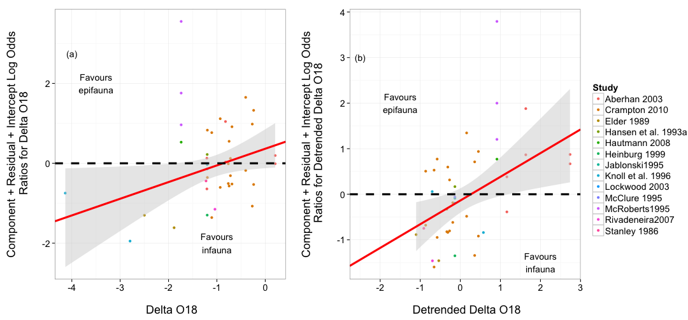

RMA Outputs
========================================================
  
  Here we go...


Broad v. Narrow Baseline
========================================================

First, we have to verify our assumptions about pooling all of the data.

Does grouping matter?

```r
taxGenera.Broad <- rma(yi = lnorReg, vi = vlnorReg, mods = ~Bivalve..Gastropod + 
    Tax.level, data = broadData)
taxGenera.Broad
```

```
## 
## Mixed-Effects Model (k = 80; tau^2 estimator: REML)
## 
## tau^2 (estimated amount of residual heterogeneity):     0.3553 (SE = 0.1245)
## tau (square root of estimated tau^2 value):             0.5960
## I^2 (residual heterogeneity / unaccounted variability): 49.52%
## H^2 (unaccounted variability / sampling variability):   1.98
## 
## Test for Residual Heterogeneity: 
## QE(df = 77) = 149.2280, p-val < .0001
## 
## Test of Moderators (coefficient(s) 2,3): 
## QM(df = 2) = 1.4411, p-val = 0.4865
## 
## Model Results:
## 
##                              estimate      se     zval    pval    ci.lb
## intrcpt                        1.1432  0.1731   6.6053  <.0001   0.8040
## Bivalve..GastropodGastropod    0.1126  0.2180   0.5163  0.6057  -0.3147
## Tax.levelSpecies              -0.2358  0.2104  -1.1204  0.2626  -0.6482
##                               ci.ub     
## intrcpt                      1.4825  ***
## Bivalve..GastropodGastropod  0.5399     
## Tax.levelSpecies             0.1767     
## 
## ---
## Signif. codes:  0 '***' 0.001 '**' 0.01 '*' 0.05 '.' 0.1 ' ' 1
```


Does Multistage matter?

```r
multStage.Broad <- rma(yi = lnorReg, vi = vlnorReg, mods = ~MultipleStages, 
    data = broadData)
multStage.Broad
```

```
## 
## Mixed-Effects Model (k = 80; tau^2 estimator: REML)
## 
## tau^2 (estimated amount of residual heterogeneity):     0.3658 (SE = 0.1255)
## tau (square root of estimated tau^2 value):             0.6048
## I^2 (residual heterogeneity / unaccounted variability): 50.45%
## H^2 (unaccounted variability / sampling variability):   2.02
## 
## Test for Residual Heterogeneity: 
## QE(df = 78) = 151.8594, p-val < .0001
## 
## Test of Moderators (coefficient(s) 2): 
## QM(df = 1) = 0.2337, p-val = 0.6288
## 
## Model Results:
## 
##                     estimate      se    zval    pval    ci.lb   ci.ub     
## intrcpt               0.9790  0.1741  5.6224  <.0001   0.6377  1.3203  ***
## MultipleStagesTRUE    0.1052  0.2175  0.4835  0.6288  -0.3212  0.5315     
## 
## ---
## Signif. codes:  0 '***' 0.001 '**' 0.01 '*' 0.05 '.' 0.1 ' ' 1
```


Does Global v. Regional matter?

```r
scale.Broad <- rma(yi = lnorReg, vi = vlnorReg, mods = ~Global.Regional, data = broadData)
scale.Broad
```

```
## 
## Mixed-Effects Model (k = 80; tau^2 estimator: REML)
## 
## tau^2 (estimated amount of residual heterogeneity):     0.3622 (SE = 0.1247)
## tau (square root of estimated tau^2 value):             0.6018
## I^2 (residual heterogeneity / unaccounted variability): 50.25%
## H^2 (unaccounted variability / sampling variability):   2.01
## 
## Test for Residual Heterogeneity: 
## QE(df = 78) = 151.9811, p-val < .0001
## 
## Test of Moderators (coefficient(s) 2): 
## QM(df = 1) = 0.4515, p-val = 0.5016
## 
## Model Results:
## 
##                   estimate      se    zval    pval    ci.lb   ci.ub     
## intrcpt             0.9926  0.1311  7.5701  <.0001   0.7356  1.2495  ***
## Global.Regional1    0.1449  0.2156  0.6719  0.5016  -0.2777  0.5674     
## 
## ---
## Signif. codes:  0 '***' 0.001 '**' 0.01 '*' 0.05 '.' 0.1 ' ' 1
```


Does Time Matter?

```r
time.Broad <- rma(yi = lnorReg, vi = meanDate, mods = ~meanDate, data = broadData)
time.Broad
```

```
## 
## Mixed-Effects Model (k = 80; tau^2 estimator: REML)
## 
## tau^2 (estimated amount of residual heterogeneity):     0 (SE = 1.0284)
## tau (square root of estimated tau^2 value):             0
## I^2 (residual heterogeneity / unaccounted variability): 0.00%
## H^2 (unaccounted variability / sampling variability):   1.00
## 
## Test for Residual Heterogeneity: 
## QE(df = 78) = 5.4225, p-val = 1.0000
## 
## Test of Moderators (coefficient(s) 2): 
## QM(df = 1) = 0.0066, p-val = 0.9351
## 
## Model Results:
## 
##           estimate      se    zval    pval    ci.lb   ci.ub   
## intrcpt     0.9550  0.4591  2.0802  0.0375   0.0552  1.8548  *
## meanDate    0.0007  0.0091  0.0814  0.9351  -0.0172  0.0186   
## 
## ---
## Signif. codes:  0 '***' 0.001 '**' 0.01 '*' 0.05 '.' 0.1 ' ' 1
```


If we pool everything, what is our grand mean Log Odds Ratio for Broad v. Narrow?

```r
broad.rma <- rma(yi = lnorReg, vi = vlnorReg, data = broadData)
broad.rma
```

```
## 
## Random-Effects Model (k = 80; tau^2 estimator: REML)
## 
## tau^2 (estimated amount of total heterogeneity): 0.3534 (SE = 0.1217)
## tau (square root of estimated tau^2 value):      0.5945
## I^2 (total heterogeneity / total variability):   49.94%
## H^2 (total variability / sampling variability):  2.00
## 
## Test for Heterogeneity: 
## Q(df = 79) = 152.1462, p-val < .0001
## 
## Model Results:
## 
## estimate       se     zval     pval    ci.lb    ci.ub          
##   1.0456   0.1034  10.1103   <.0001   0.8429   1.2483      *** 
## 
## ---
## Signif. codes:  0 '***' 0.001 '**' 0.01 '*' 0.05 '.' 0.1 ' ' 1
```

```r

####### Fig 1
```


Figure 1
========================================================

```r
pdf("figure/broad_narrow_rma.pdf", width = 3.7, height = 7.5)
plot_effect_sizes(broadData, rma.model = broad.rma, lab = c("narrow", "broad"))
dev.off()
```

```
## pdf 
##   2
```

```r
plot_effect_sizes(broadData, rma.model = broad.rma, lab = c("narrow", "broad"))
```

 


Epifauna v. Infauna Baseline
========================================================
  
Are Bivalves or Gastropods Different?

```r
bivalve.gastro.Epifaunal <- rma(yi = lnorReg, vi = vlnorReg, data = habitData, 
    mod = ~Bivalve..Gastropod - 1)
bivalve.gastro.Epifaunal
```

```
## 
## Mixed-Effects Model (k = 49; tau^2 estimator: REML)
## 
## tau^2 (estimated amount of residual heterogeneity):     0.4387 (SE = 0.1667)
## tau (square root of estimated tau^2 value):             0.6623
## I^2 (residual heterogeneity / unaccounted variability): 59.42%
## H^2 (unaccounted variability / sampling variability):   2.46
## 
## Test for Residual Heterogeneity: 
## QE(df = 47) = 118.6184, p-val < .0001
## 
## Test of Moderators (coefficient(s) 1,2): 
## QM(df = 2) = 0.8539, p-val = 0.6525
## 
## Model Results:
## 
##                              estimate      se     zval    pval    ci.lb
## Bivalve..GastropodBivalve     -0.1248  0.1468  -0.8507  0.3950  -0.4125
## Bivalve..GastropodGastropod    0.1098  0.3042   0.3609  0.7182  -0.4865
##                               ci.ub   
## Bivalve..GastropodBivalve    0.1628   
## Bivalve..GastropodGastropod  0.7061   
## 
## ---
## Signif. codes:  0 '***' 0.001 '**' 0.01 '*' 0.05 '.' 0.1 ' ' 1
```

```r

##### So, we pool.  Let's look at things, then
```

No - they are broadly the same.


Does global v. regional extinction matter?

```r
scale.habit <- rma(yi = lnorReg, vi = vlnorReg, mods = ~Global.Regional, data = habitData)
scale.habit
```

```
## 
## Mixed-Effects Model (k = 49; tau^2 estimator: REML)
## 
## tau^2 (estimated amount of residual heterogeneity):     0.4391 (SE = 0.1677)
## tau (square root of estimated tau^2 value):             0.6626
## I^2 (residual heterogeneity / unaccounted variability): 58.38%
## H^2 (unaccounted variability / sampling variability):   2.40
## 
## Test for Residual Heterogeneity: 
## QE(df = 47) = 119.4409, p-val < .0001
## 
## Test of Moderators (coefficient(s) 2): 
## QM(df = 1) = 1.9268, p-val = 0.1651
## 
## Model Results:
## 
##                   estimate      se     zval    pval    ci.lb   ci.ub   
## intrcpt            -0.0067  0.1425  -0.0473  0.9622  -0.2861  0.2726   
## Global.Regional1   -0.5303  0.3821  -1.3881  0.1651  -1.2791  0.2185   
## 
## ---
## Signif. codes:  0 '***' 0.001 '**' 0.01 '*' 0.05 '.' 0.1 ' ' 1
```


Does time matter?

```r
# SA 20130119: I changed bivalvesEpifaunal to habitatData. I believe this
# was just a mistake when copying the code over
time.Epifaunal <- rma(yi = lnorReg, vi = vlnorReg, data = habitData, mods = ~meanDate)
time.Epifaunal
```

```
## 
## Mixed-Effects Model (k = 49; tau^2 estimator: REML)
## 
## tau^2 (estimated amount of residual heterogeneity):     0.4313 (SE = 0.1653)
## tau (square root of estimated tau^2 value):             0.6567
## I^2 (residual heterogeneity / unaccounted variability): 58.85%
## H^2 (unaccounted variability / sampling variability):   2.43
## 
## Test for Residual Heterogeneity: 
## QE(df = 47) = 114.0778, p-val < .0001
## 
## Test of Moderators (coefficient(s) 2): 
## QM(df = 1) = 1.0288, p-val = 0.3104
## 
## Model Results:
## 
##           estimate      se     zval    pval    ci.lb   ci.ub   
## intrcpt    -0.2087  0.1821  -1.1460  0.2518  -0.5656  0.1482   
## meanDate    0.0015  0.0014   1.0143  0.3104  -0.0014  0.0043   
## 
## ---
## Signif. codes:  0 '***' 0.001 '**' 0.01 '*' 0.05 '.' 0.1 ' ' 1
```


If we pool everything, what is our grand mean Log Odds Ratio for Epifaunal v. Infaunal?

```r
meanModel.Epifaunal <- rma(yi = lnorReg, vi = vlnorReg, data = habitData)
meanModel.Epifaunal
```

```
## 
## Random-Effects Model (k = 49; tau^2 estimator: REML)
## 
## tau^2 (estimated amount of total heterogeneity): 0.4339 (SE = 0.1640)
## tau (square root of estimated tau^2 value):      0.6587
## I^2 (total heterogeneity / total variability):   59.09%
## H^2 (total variability / sampling variability):  2.44
## 
## Test for Heterogeneity: 
## Q(df = 48) = 119.9424, p-val < .0001
## 
## Model Results:
## 
## estimate       se     zval     pval    ci.lb    ci.ub          
##  -0.0808   0.1318  -0.6133   0.5397  -0.3391   0.1775          
## 
## ---
## Signif. codes:  0 '***' 0.001 '**' 0.01 '*' 0.05 '.' 0.1 ' ' 1
```


Figure 2
========================================================

```r
pdf("figure/inf_epi_rma.pdf", width = 3.7, height = 6)
plot_effect_sizes(habitData, meanModel.Epifaunal, lab = c("infauna", "epifauna"))
dev.off()
```

```
## pdf 
##   2
```

```r
plot_effect_sizes(habitData, meanModel.Epifaunal, lab = c("infauna", "epifauna"))
```

 

```r

# now fix up the labels (spacing and the et al.s)
```


Modeled Results
========================================================
The Fitted Model for Broad v. Narrow

```r
broadDataExtinction <- broadData[which(!is.na(broadData$BC.extinction.ratePBDB)), 
    ]
broadDataExtinction <- broadDataExtinction[which(!is.na(broadDataExtinction$del.18O)), 
    ]
broadDataExtinction <- broadDataExtinction[which(!is.na(broadDataExtinction$del.34S)), 
    ]
broadDataExtinction <- broadDataExtinction[which(!is.na(broadDataExtinction$del.13C)), 
    ]

covModel.Broad.RMA <- rma(yi = lnorReg, vi = vlnorReg, data = broadDataExtinction, 
    mods = ~OA + BC.extinction.ratePBDB + del.18O + del.34S + del.13C)

covModel.Broad.RMA
```

```
## 
## Mixed-Effects Model (k = 43; tau^2 estimator: REML)
## 
## tau^2 (estimated amount of residual heterogeneity):     0.0766 (SE = 0.1078)
## tau (square root of estimated tau^2 value):             0.2768
## I^2 (residual heterogeneity / unaccounted variability): 14.76%
## H^2 (unaccounted variability / sampling variability):   1.17
## 
## Test for Residual Heterogeneity: 
## QE(df = 37) = 47.6175, p-val = 0.1134
## 
## Test of Moderators (coefficient(s) 2,3,4,5,6): 
## QM(df = 5) = 10.7388, p-val = 0.0568
## 
## Model Results:
## 
##                         estimate      se     zval    pval    ci.lb
## intrcpt                   1.1538  0.2113   5.4595  <.0001   0.7396
## OA                        0.1191  0.3173   0.3752  0.7075  -0.5028
## BC.extinction.ratePBDB   -0.1837  2.7645  -0.0665  0.9470  -5.6021
## del.18O                  -0.1054  0.1938  -0.5439  0.5865  -0.4852
## del.34S                  -0.1064  0.0473  -2.2486  0.0245  -0.1992
## del.13C                  -0.2710  0.1498  -1.8087  0.0705  -0.5646
##                           ci.ub     
## intrcpt                  1.5680  ***
## OA                       0.7409     
## BC.extinction.ratePBDB   5.2346     
## del.18O                  0.2744     
## del.34S                 -0.0137    *
## del.13C                  0.0227    .
## 
## ---
## Signif. codes:  0 '***' 0.001 '**' 0.01 '*' 0.05 '.' 0.1 ' ' 1
```

```r

write.csv(coef(covModel.Broad.RMA), "./broadCoefTable.csv", row.names = T)

broadCoefPlot <- coefPlot(covModel.Broad.RMA, robust = F, std = T) + scale_x_discrete(labels = c("Extinction Rate", 
    expression(delta^18 * O), expression(delta^13 * C), expression(delta^34 * 
        S), "Acidification"), expand = c(0.15, 0)) + annotate("text", x = 5, 
    y = -0.4, label = "A)") + ylim(c(-0.5, 0.5)) + coord_flip() + annotate("text", 
    x = 5.6, y = -0.35, label = "Favours\nnarrow") + annotate("text", x = 5.6, 
    y = 0.35, label = "Favours\nbroad")
```


The Fitted Model for Epifauna v. Infauna

```r
habitDataGood <- habitData[which(!(is.na(habitData$BC.extinction.ratePBDB))), 
    ]
habitDataGood <- habitDataGood[which(!(is.na(habitDataGood$lnorReg))), ]
habitDataGood <- habitDataGood[which(!(is.na(habitDataGood$del.34S))), ]
habitDataGood <- habitDataGood[which(!(is.na(habitDataGood$del.18O))), ]

covModel.Epifaunal.rma <- rma(yi = lnorReg, vi = vlnorReg, data = habitDataGood, 
    mods = ~OA + BC.extinction.ratePBDB + del.18O + del.34S)

covModel.Epifaunal.rma
```

```
## 
## Mixed-Effects Model (k = 23; tau^2 estimator: REML)
## 
## tau^2 (estimated amount of residual heterogeneity):     0.4553 (SE = 0.2817)
## tau (square root of estimated tau^2 value):             0.6748
## I^2 (residual heterogeneity / unaccounted variability): 56.00%
## H^2 (unaccounted variability / sampling variability):   2.27
## 
## Test for Residual Heterogeneity: 
## QE(df = 18) = 41.1549, p-val = 0.0014
## 
## Test of Moderators (coefficient(s) 2,3,4,5): 
## QM(df = 4) = 3.0546, p-val = 0.5487
## 
## Model Results:
## 
##                         estimate      se     zval    pval    ci.lb
## intrcpt                   0.1056  0.5088   0.2075  0.8356  -0.8916
## OA                       -0.4196  0.7752  -0.5412  0.5883  -1.9391
## BC.extinction.ratePBDB    9.0415  9.2624   0.9762  0.3290  -9.1124
## del.18O                   0.0543  0.3909   0.1388  0.8896  -0.7118
## del.34S                  -0.1026  0.1077  -0.9527  0.3407  -0.3136
##                           ci.ub   
## intrcpt                  1.1028   
## OA                       1.0999   
## BC.extinction.ratePBDB  27.1954   
## del.18O                  0.8203   
## del.34S                  0.1084   
## 
## ---
## Signif. codes:  0 '***' 0.001 '**' 0.01 '*' 0.05 '.' 0.1 ' ' 1
```

```r
write.csv(coef(covModel.Epifaunal.rma), "./epiCoefTable.csv", row.names = T)


epiCoefPlot <- coefPlot(covModel.Epifaunal.rma, habitDataGood, robust = F, std = T) + 
    scale_x_discrete(labels = c("Extinction Rate", expression(delta^18 * O), 
        expression(delta^34 * S), "Acidification"), expand = c(0.15, 0)) + annotate("text", 
    x = 4, y = -1, label = "B)") + ylim(c(-1.25, 1.25)) + coord_flip() + annotate("text", 
    x = 4.6, y = -0.7, label = "Favours\ninfauna") + annotate("text", x = 4.6, 
    y = 0.7, label = "Favours\nepifauna")
```


Figure 4
========================================================

```r
grid.arrange(broadCoefPlot + theme_bw(base_size = 18), epiCoefPlot + theme_bw(base_size = 18), 
    ncol = 2)
```

```
## Warning: is.na() applied to non-(list or vector) of type 'expression'
```

```
## Warning: Removed 1 rows containing missing values (geom_segment).
```

```
## Warning: is.na() applied to non-(list or vector) of type 'expression'
```

 


Figure 5
========================================================

```r
#### What are the marginal effects from the model
del18marg <- marginalLine(covModel.Epifaunal.rma, "del.18O", habitDataGood, 
    robust = F) + xlab("\n Detrended Delta O18") + ylab("Component + Residual + Intercept Log Odds\n Ratios for Detrended Delta O18\n") + 
    annotate("text", x = -4, y = 8.75, label = "A)") + scale_color_discrete(guide = "none") + 
    theme_bw(base_size = 18)

del18MargData <- marginalData(covModel.Epifaunal.rma, "del.18O", habitDataGood)
write.csv(del18MargData, "./del18MargData.csv", row.names = F)

del34marg <- marginalLine(covModel.Epifaunal.rma, "del.34S", habitDataGood, 
    robust = F) + xlab("\n Delta S34") + ylab("Component + Residual + Intercept Log Odds\n Ratios for Delta 34S\n") + 
    annotate("text", x = 13.75, y = 3.375, label = "B)") + theme_bw(base_size = 18)

del34margData <- marginalData(covModel.Epifaunal.rma, "del.34S", habitDataGood)
write.csv(del34margData, "./del34margData.csv", row.names = F)

# Extract Legend
g_legend <- function(a.gplot) {
    a.gplot <- a.gplot + scale_color_discrete("Study")
    tmp <- ggplot_gtable(ggplot_build(a.gplot))
    leg <- which(sapply(tmp$grobs, function(x) x$name) == "guide-box")
    legend <- tmp$grobs[[leg]]
    return(legend)
}

legend <- g_legend(del34marg)


grid.arrange(del18marg, del34marg + scale_color_discrete(guide = "none"), legend, 
    widths = c(3, 3, 1), nrow = 1)
```

 


Appendix Jackknife Figures
========================================================

```
## Using as id variables
```

```
## Using as id variables
```

```
## Using as id variables
```

```
## Using as id variables
```

```
## Using as id variables
```

```
## Using as id variables
```

```
## Using as id variables
```

```
## Using as id variables
```

```
## Using as id variables
```

```
## Using as id variables
```

```
## Using as id variables
```

```
## Using as id variables
```

```
## Using as id variables
```

```
## Using as id variables
```

```
## Using as id variables
```

 

```
## Using as id variables
```

```
## Using as id variables
```

```
## Using as id variables
```

```
## Using as id variables
```

```
## Using as id variables
```

```
## Using as id variables
```

```
## Using as id variables
```

```
## Using as id variables
```

```
## Using as id variables
```

 


```r
funnel(broad.rma, main = "Funnel Plot for Broad v. Narrow Analysis")
```

 

```r
funnel(meanModel.Epifaunal, main = "Funnel Plot for Epifauna v. Infauna Analysis")
```

 

