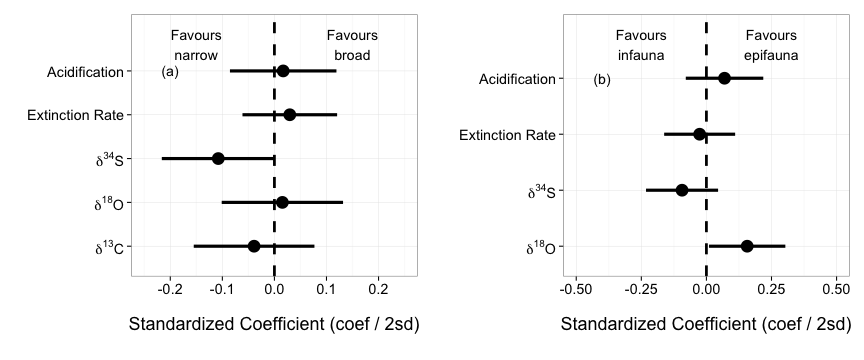

RMA Outputs
========================================================
  
  Here we go...


Broad v. Narrow Baseline
========================================================

First, we have to verify our assumptions about pooling all of the data.

Does grouping matter?

```r
taxGenera.Broad <- rma(yi = lnorReg, vi = vlnorReg, mods = ~Bivalve..Gastropod + 
    Tax.level, data = broadData)
taxGenera.Broad
```

```
## 
## Mixed-Effects Model (k = 80; tau^2 estimator: REML)
## 
## tau^2 (estimated amount of residual heterogeneity):     0.4671 (SE = 0.1465)
## tau (square root of estimated tau^2 value):             0.6834
## I^2 (residual heterogeneity / unaccounted variability): 56.53%
## H^2 (unaccounted variability / sampling variability):   2.30
## 
## Test for Residual Heterogeneity: 
## QE(df = 77) = 175.9544, p-val < .0001
## 
## Test of Moderators (coefficient(s) 2,3): 
## QM(df = 2) = 0.8493, p-val = 0.6540
## 
## Model Results:
## 
##                              estimate      se     zval    pval    ci.lb
## intrcpt                        1.0821  0.1866   5.7990  <.0001   0.7164
## Bivalve..GastropodGastropod    0.1284  0.2346   0.5474  0.5841  -0.3314
## Tax.levelSpecies              -0.1747  0.2261  -0.7726  0.4398  -0.6179
##                               ci.ub     
## intrcpt                      1.4478  ***
## Bivalve..GastropodGastropod  0.5883     
## Tax.levelSpecies             0.2685     
## 
## ---
## Signif. codes:  0 '***' 0.001 '**' 0.01 '*' 0.05 '.' 0.1 ' ' 1
```


Does Multistage matter?

```r
multStage.Broad <- rma(yi = lnorReg, vi = vlnorReg, mods = ~MultipleStages, 
    data = broadData)
multStage.Broad
```

```
## 
## Mixed-Effects Model (k = 80; tau^2 estimator: REML)
## 
## tau^2 (estimated amount of residual heterogeneity):     0.4736 (SE = 0.1465)
## tau (square root of estimated tau^2 value):             0.6882
## I^2 (residual heterogeneity / unaccounted variability): 57.07%
## H^2 (unaccounted variability / sampling variability):   2.33
## 
## Test for Residual Heterogeneity: 
## QE(df = 78) = 178.8792, p-val < .0001
## 
## Test of Moderators (coefficient(s) 2): 
## QM(df = 1) = 0.2376, p-val = 0.6260
## 
## Model Results:
## 
##                     estimate      se    zval    pval    ci.lb   ci.ub     
## intrcpt               0.9538  0.1864  5.1168  <.0001   0.5885  1.3192  ***
## MultipleStagesTRUE    0.1136  0.2332  0.4874  0.6260  -0.3433  0.5706     
## 
## ---
## Signif. codes:  0 '***' 0.001 '**' 0.01 '*' 0.05 '.' 0.1 ' ' 1
```


Does Global v. Regional matter?

```r
scale.Broad <- rma(yi = lnorReg, vi = vlnorReg, mods = ~Global.Regional, data = broadData)
scale.Broad
```

```
## 
## Mixed-Effects Model (k = 80; tau^2 estimator: REML)
## 
## tau^2 (estimated amount of residual heterogeneity):     0.4715 (SE = 0.1460)
## tau (square root of estimated tau^2 value):             0.6867
## I^2 (residual heterogeneity / unaccounted variability): 56.99%
## H^2 (unaccounted variability / sampling variability):   2.33
## 
## Test for Residual Heterogeneity: 
## QE(df = 78) = 178.5149, p-val < .0001
## 
## Test of Moderators (coefficient(s) 2): 
## QM(df = 1) = 0.1128, p-val = 0.7370
## 
## Model Results:
## 
##                   estimate      se    zval    pval    ci.lb   ci.ub     
## intrcpt             0.9973  0.1414  7.0545  <.0001   0.7202  1.2744  ***
## Global.Regional1    0.0776  0.2311  0.3358  0.7370  -0.3753  0.5306     
## 
## ---
## Signif. codes:  0 '***' 0.001 '**' 0.01 '*' 0.05 '.' 0.1 ' ' 1
```


Does Time Matter?

```r
time.Broad <- rma(yi = lnorReg, vi = meanDate, mods = ~meanDate, data = broadData)
time.Broad
```

```
## 
## Mixed-Effects Model (k = 80; tau^2 estimator: REML)
## 
## tau^2 (estimated amount of residual heterogeneity):     0 (SE = 1.0229)
## tau (square root of estimated tau^2 value):             0
## I^2 (residual heterogeneity / unaccounted variability): 0.00%
## H^2 (unaccounted variability / sampling variability):   1.00
## 
## Test for Residual Heterogeneity: 
## QE(df = 78) = 5.4666, p-val = 1.0000
## 
## Test of Moderators (coefficient(s) 2): 
## QM(df = 1) = 0.0046, p-val = 0.9459
## 
## Model Results:
## 
##           estimate      se    zval    pval    ci.lb   ci.ub   
## intrcpt     0.9614  0.4576  2.1011  0.0356   0.0646  1.8583  *
## meanDate    0.0006  0.0092  0.0679  0.9459  -0.0174  0.0187   
## 
## ---
## Signif. codes:  0 '***' 0.001 '**' 0.01 '*' 0.05 '.' 0.1 ' ' 1
```


If we pool everything, what is our grand mean Log Odds Ratio for Broad v. Narrow?

```r
broad.rma <- rma(yi = lnorReg, vi = vlnorReg, data = broadData)
broad.rma
```

```
## 
## Random-Effects Model (k = 80; tau^2 estimator: REML)
## 
## tau^2 (estimated amount of total heterogeneity): 0.4587 (SE = 0.1422)
## tau (square root of estimated tau^2 value):      0.6773
## I^2 (total heterogeneity / total variability):   56.63%
## H^2 (total variability / sampling variability):  2.31
## 
## Test for Heterogeneity: 
## Q(df = 79) = 178.8793, p-val < .0001
## 
## Model Results:
## 
## estimate       se     zval     pval    ci.lb    ci.ub          
##   1.0255   0.1110   9.2425   <.0001   0.8080   1.2430      *** 
## 
## ---
## Signif. codes:  0 '***' 0.001 '**' 0.01 '*' 0.05 '.' 0.1 ' ' 1
```

```r

####### Fig 1
```


Figure 1
========================================================

```r
pdf("figure/broad_narrow_rma.pdf", width = 3.7, height = 7.5)
plot_effect_sizes(broadData, rma.model = broad.rma, lab = c("narrow", "broad"))
dev.off()
```

```
## pdf 
##   2
```

```r
plot_effect_sizes(broadData, rma.model = broad.rma, lab = c("narrow", "broad"))
```

 


Epifauna v. Infauna Baseline
========================================================
  
Are Bivalves or Gastropods Different?

```r
bivalve.gastro.Epifaunal <- rma(yi = lnorReg, vi = vlnorReg, data = habitData, 
    mod = ~Bivalve..Gastropod - 1)
bivalve.gastro.Epifaunal
```

```
## 
## Mixed-Effects Model (k = 49; tau^2 estimator: REML)
## 
## tau^2 (estimated amount of residual heterogeneity):     0.4387 (SE = 0.1667)
## tau (square root of estimated tau^2 value):             0.6623
## I^2 (residual heterogeneity / unaccounted variability): 59.42%
## H^2 (unaccounted variability / sampling variability):   2.46
## 
## Test for Residual Heterogeneity: 
## QE(df = 47) = 118.6184, p-val < .0001
## 
## Test of Moderators (coefficient(s) 1,2): 
## QM(df = 2) = 0.8539, p-val = 0.6525
## 
## Model Results:
## 
##                              estimate      se     zval    pval    ci.lb
## Bivalve..GastropodBivalve     -0.1248  0.1468  -0.8507  0.3950  -0.4125
## Bivalve..GastropodGastropod    0.1098  0.3042   0.3609  0.7182  -0.4865
##                               ci.ub   
## Bivalve..GastropodBivalve    0.1628   
## Bivalve..GastropodGastropod  0.7061   
## 
## ---
## Signif. codes:  0 '***' 0.001 '**' 0.01 '*' 0.05 '.' 0.1 ' ' 1
```

```r

##### So, we pool.  Let's look at things, then
```

No - they are broadly the same.


Does global v. regional extinction matter?

```r
scale.habit <- rma(yi = lnorReg, vi = vlnorReg, mods = ~Global.Regional, data = habitData)
scale.habit
```

```
## 
## Mixed-Effects Model (k = 49; tau^2 estimator: REML)
## 
## tau^2 (estimated amount of residual heterogeneity):     0.4391 (SE = 0.1677)
## tau (square root of estimated tau^2 value):             0.6626
## I^2 (residual heterogeneity / unaccounted variability): 58.38%
## H^2 (unaccounted variability / sampling variability):   2.40
## 
## Test for Residual Heterogeneity: 
## QE(df = 47) = 119.4409, p-val < .0001
## 
## Test of Moderators (coefficient(s) 2): 
## QM(df = 1) = 1.9268, p-val = 0.1651
## 
## Model Results:
## 
##                   estimate      se     zval    pval    ci.lb   ci.ub   
## intrcpt            -0.0067  0.1425  -0.0473  0.9622  -0.2861  0.2726   
## Global.Regional1   -0.5303  0.3821  -1.3881  0.1651  -1.2791  0.2185   
## 
## ---
## Signif. codes:  0 '***' 0.001 '**' 0.01 '*' 0.05 '.' 0.1 ' ' 1
```


Does time matter?

```r
# SA 20130119: I changed bivalvesEpifaunal to habitatData. I believe this
# was just a mistake when copying the code over
time.Epifaunal <- rma(yi = lnorReg, vi = vlnorReg, data = habitData, mods = ~meanDate)
time.Epifaunal
```

```
## 
## Mixed-Effects Model (k = 49; tau^2 estimator: REML)
## 
## tau^2 (estimated amount of residual heterogeneity):     0.4289 (SE = 0.1648)
## tau (square root of estimated tau^2 value):             0.6549
## I^2 (residual heterogeneity / unaccounted variability): 58.69%
## H^2 (unaccounted variability / sampling variability):   2.42
## 
## Test for Residual Heterogeneity: 
## QE(df = 47) = 113.5364, p-val < .0001
## 
## Test of Moderators (coefficient(s) 2): 
## QM(df = 1) = 1.1641, p-val = 0.2806
## 
## Model Results:
## 
##           estimate      se     zval    pval    ci.lb   ci.ub   
## intrcpt    -0.2352  0.1940  -1.2122  0.2254  -0.6156  0.1451   
## meanDate    0.0032  0.0030   1.0789  0.2806  -0.0026  0.0091   
## 
## ---
## Signif. codes:  0 '***' 0.001 '**' 0.01 '*' 0.05 '.' 0.1 ' ' 1
```


If we pool everything, what is our grand mean Log Odds Ratio for Epifaunal v. Infaunal?

```r
meanModel.Epifaunal <- rma(yi = lnorReg, vi = vlnorReg, data = habitData)
meanModel.Epifaunal
```

```
## 
## Random-Effects Model (k = 49; tau^2 estimator: REML)
## 
## tau^2 (estimated amount of total heterogeneity): 0.4339 (SE = 0.1640)
## tau (square root of estimated tau^2 value):      0.6587
## I^2 (total heterogeneity / total variability):   59.09%
## H^2 (total variability / sampling variability):  2.44
## 
## Test for Heterogeneity: 
## Q(df = 48) = 119.9424, p-val < .0001
## 
## Model Results:
## 
## estimate       se     zval     pval    ci.lb    ci.ub          
##  -0.0808   0.1318  -0.6133   0.5397  -0.3391   0.1775          
## 
## ---
## Signif. codes:  0 '***' 0.001 '**' 0.01 '*' 0.05 '.' 0.1 ' ' 1
```


Figure 2
========================================================

```r
pdf("figure/inf_epi_rma.pdf", width = 3.7, height = 6)
plot_effect_sizes(habitData, meanModel.Epifaunal, lab = c("infauna", "epifauna"))
dev.off()
```

```
## pdf 
##   2
```

```r
plot_effect_sizes(habitData, meanModel.Epifaunal, lab = c("infauna", "epifauna"))
```

 

```r

# now fix up the labels (spacing and the et al.s)
```


Modeled Results
========================================================
The Fitted Model for Broad v. Narrow

```r
broadDataExtinction <- broadData[which(!is.na(broadData$BC.extinction.ratePBDB)), 
    ]
broadDataExtinction <- broadDataExtinction[which(!is.na(broadDataExtinction$del.18O)), 
    ]
broadDataExtinction <- broadDataExtinction[which(!is.na(broadDataExtinction$del.34S)), 
    ]
broadDataExtinction <- broadDataExtinction[which(!is.na(broadDataExtinction$del.13C)), 
    ]

covModel.Broad.RMA <- rma(yi = lnorReg, vi = vlnorReg, data = broadDataExtinction, 
    mods = ~OA + BC.extinction.ratePBDB + del.18O + del.34S + del.13C)

covModel.Broad.RMA
```

```
## 
## Mixed-Effects Model (k = 63; tau^2 estimator: REML)
## 
## tau^2 (estimated amount of residual heterogeneity):     0.1486 (SE = 0.0979)
## tau (square root of estimated tau^2 value):             0.3855
## I^2 (residual heterogeneity / unaccounted variability): 27.64%
## H^2 (unaccounted variability / sampling variability):   1.38
## 
## Test for Residual Heterogeneity: 
## QE(df = 57) = 81.2599, p-val = 0.0191
## 
## Test of Moderators (coefficient(s) 2,3,4,5,6): 
## QM(df = 5) = 8.9953, p-val = 0.1093
## 
## Model Results:
## 
##                         estimate      se     zval    pval    ci.lb   ci.ub
## intrcpt                   0.9919  0.1446   6.8592  <.0001   0.7085  1.2754
## OA                        0.3257  0.2701   1.2059  0.2279  -0.2037  0.8551
## BC.extinction.ratePBDB    0.2174  1.0608   0.2050  0.8376  -1.8618  2.2966
## del.18O                   0.0615  0.1191   0.5169  0.6052  -0.1718  0.2949
## del.34S                  -0.0370  0.0308  -1.2037  0.2287  -0.0973  0.0233
## del.13C                   0.1569  0.1306   1.2018  0.2294  -0.0990  0.4129
##                            
## intrcpt                 ***
## OA                         
## BC.extinction.ratePBDB     
## del.18O                    
## del.34S                    
## del.13C                    
## 
## ---
## Signif. codes:  0 '***' 0.001 '**' 0.01 '*' 0.05 '.' 0.1 ' ' 1
```

```r

write.csv(coef(covModel.Broad.RMA), "./broadCoefTable.csv", row.names = T)

broadCoefPlot <- coefPlot(covModel.Broad.RMA, robust = F, std = T) + scale_x_discrete(labels = c("Extinction Rate", 
    expression(delta^18 * O), expression(delta^13 * C), expression(delta^34 * 
        S), "Acidification"), expand = c(0.15, 0)) + annotate("text", x = 5, 
    y = -0.4, label = "A)") + ylim(c(-0.5, 0.5)) + coord_flip() + annotate("text", 
    x = 5.6, y = -0.35, label = "Favours\nnarrow") + annotate("text", x = 5.6, 
    y = 0.35, label = "Favours\nbroad")
```


The Fitted Model for Epifauna v. Infauna

```r
habitDataGood <- habitData[which(!(is.na(habitData$BC.extinction.ratePBDB))), 
    ]
habitDataGood <- habitDataGood[which(!(is.na(habitDataGood$lnorReg))), ]
habitDataGood <- habitDataGood[which(!(is.na(habitDataGood$del.34S))), ]
habitDataGood <- habitDataGood[which(!(is.na(habitDataGood$del.18O))), ]


# TODO WARNING Error in qr.solve(wX, diag(k)) : singular matrix 'a' in
# solve TODO WARNING there are no OA events: they're all 0
covModel.Epifaunal.rma <- rma(yi = lnorReg, vi = vlnorReg, data = habitDataGood, 
    mods = ~BC.extinction.ratePBDB + del.18O + del.34S)

covModel.Epifaunal.rma
```

```
## 
## Mixed-Effects Model (k = 18; tau^2 estimator: REML)
## 
## tau^2 (estimated amount of residual heterogeneity):     0.3993 (SE = 0.3273)
## tau (square root of estimated tau^2 value):             0.6319
## I^2 (residual heterogeneity / unaccounted variability): 47.20%
## H^2 (unaccounted variability / sampling variability):   1.89
## 
## Test for Residual Heterogeneity: 
## QE(df = 14) = 26.1025, p-val = 0.0251
## 
## Test of Moderators (coefficient(s) 2,3,4): 
## QM(df = 3) = 2.0942, p-val = 0.5531
## 
## Model Results:
## 
##                         estimate      se     zval    pval     ci.lb
## intrcpt                   3.8197  4.8509   0.7874  0.4310   -5.6878
## BC.extinction.ratePBDB    3.3828  7.1938   0.4702  0.6382  -10.7169
## del.18O                   0.3815  0.5919   0.6447  0.5191   -0.7785
## del.34S                  -1.0964  1.1872  -0.9235  0.3557   -3.4233
##                           ci.ub   
## intrcpt                 13.3272   
## BC.extinction.ratePBDB  17.4825   
## del.18O                  1.5416   
## del.34S                  1.2305   
## 
## ---
## Signif. codes:  0 '***' 0.001 '**' 0.01 '*' 0.05 '.' 0.1 ' ' 1
```

```r
write.csv(coef(covModel.Epifaunal.rma), "./epiCoefTable.csv", row.names = T)


epiCoefPlot <- coefPlot(covModel.Epifaunal.rma, habitDataGood, robust = F, std = T) + 
    scale_x_discrete(labels = c("Extinction Rate", expression(delta^18 * O), 
        expression(delta^34 * S)), expand = c(0.15, 0)) + annotate("text", x = 4, 
    y = -1, label = "B)") + ylim(c(-1.25, 1.25)) + coord_flip() + annotate("text", 
    x = 4.6, y = -0.7, label = "Favours\ninfauna") + annotate("text", x = 4.6, 
    y = 0.7, label = "Favours\nepifauna")
```


Figure 4
========================================================

```r
grid.arrange(broadCoefPlot + theme_bw(base_size = 18), epiCoefPlot + theme_bw(base_size = 18), 
    ncol = 2)
```

```
## Warning: is.na() applied to non-(list or vector) of type 'expression'
```

```
## Warning: is.na() applied to non-(list or vector) of type 'expression'
```

 


Figure 5
========================================================

```r
#### What are the marginal effects from the model
del18marg <- marginalLine(covModel.Epifaunal.rma, "del.18O", habitDataGood, 
    robust = F) + xlab("\n Detrended Delta O18") + ylab("Component + Residual + Intercept Log Odds\n Ratios for Detrended Delta O18\n") + 
    annotate("text", x = -4, y = 8.75, label = "A)") + scale_color_discrete(guide = "none") + 
    theme_bw(base_size = 18)

del18MargData <- marginalData(covModel.Epifaunal.rma, "del.18O", habitDataGood)
write.csv(del18MargData, "./del18MargData.csv", row.names = F)

del34marg <- marginalLine(covModel.Epifaunal.rma, "del.34S", habitDataGood, 
    robust = F) + xlab("\n Delta S34") + ylab("Component + Residual + Intercept Log Odds\n Ratios for Delta 34S\n") + 
    annotate("text", x = 13.75, y = 3.375, label = "B)") + theme_bw(base_size = 18)

del34margData <- marginalData(covModel.Epifaunal.rma, "del.34S", habitDataGood)
write.csv(del34margData, "./del34margData.csv", row.names = F)

# Extract Legend
g_legend <- function(a.gplot) {
    a.gplot <- a.gplot + scale_color_discrete("Study")
    tmp <- ggplot_gtable(ggplot_build(a.gplot))
    leg <- which(sapply(tmp$grobs, function(x) x$name) == "guide-box")
    legend <- tmp$grobs[[leg]]
    return(legend)
}

legend <- g_legend(del34marg)


grid.arrange(del18marg, del34marg + scale_color_discrete(guide = "none"), legend, 
    widths = c(3, 3, 1), nrow = 1)
```

 


Appendix Jackknife Figures
========================================================

```
## Using as id variables
```

```
## Using as id variables
```

```
## Using as id variables
```

```
## Using as id variables
```

```
## Using as id variables
```

```
## Using as id variables
```

```
## Using as id variables
```

```
## Using as id variables
```

```
## Using as id variables
```

```
## Using as id variables
```

```
## Using as id variables
```

```
## Using as id variables
```

```
## Using as id variables
```

```
## Using as id variables
```

```
## Using as id variables
```

```
## Using as id variables
```

```
## Using as id variables
```

```
## Using as id variables
```

```
## Using as id variables
```

```
## Using as id variables
```

```
## Using as id variables
```

 

```
## Error: Processing terminated since k = 0.
```


```r
funnel(broad.rma, main = "Funnel Plot for Broad v. Narrow Analysis")
```

 

```r
funnel(meanModel.Epifaunal, main = "Funnel Plot for Epifauna v. Infauna Analysis")
```

 

