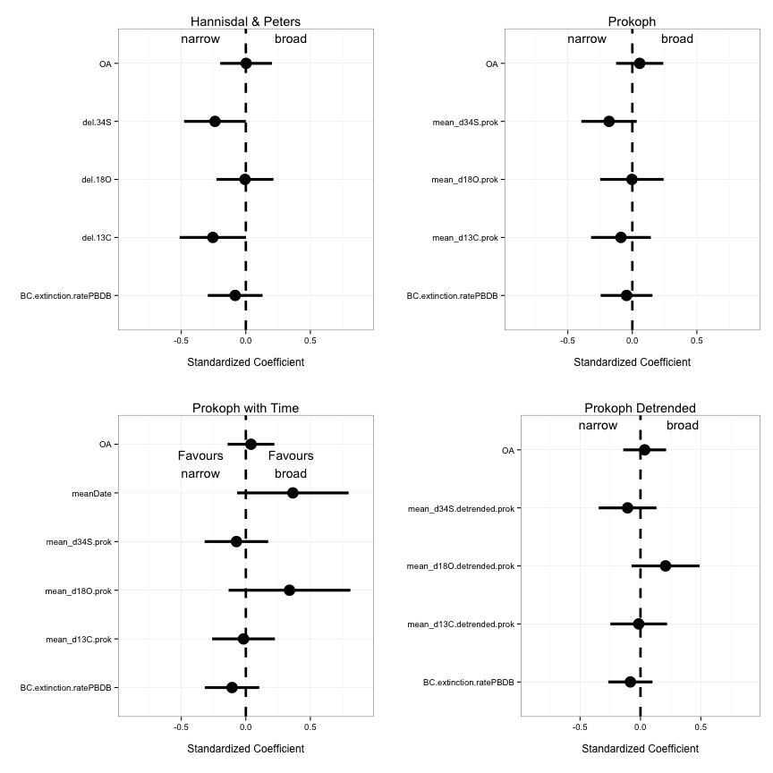
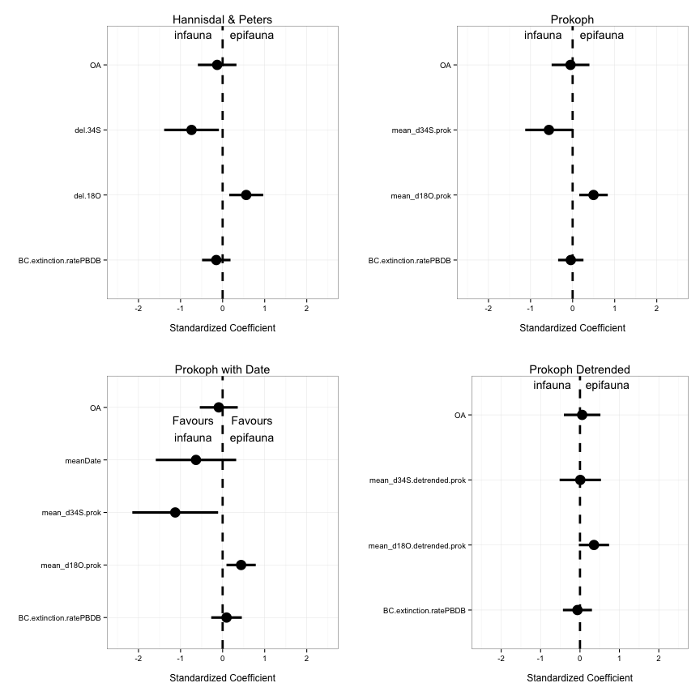

Comparing different Proxies
========================================================

A brief comparison of the H&P proxies versus the Prokoph proxies with a few different models.


```
## Loading required package: Formula
## 
## Loading 'metafor' package (version 1.9-2). For an overview 
## and introduction to the package please type: help(metafor).
## Loading required package: grid
## Loading required package: Matrix
## 
## Attaching package: 'lme4'
## 
## The following object is masked from 'package:ggplot2':
## 
##     fortify
## 
## 
## Attaching package: 'reshape'
## 
## The following object is masked _by_ '.GlobalEnv':
## 
##     sort_df
## 
## The following object is masked from 'package:Matrix':
## 
##     expand
## 
## The following objects are masked from 'package:plyr':
## 
##     rename, round_any
```


Here are four models, all using the form effect ~ BC.extinction.ratePBDB + OA + del.18O + del.34S + del.13C. Model 1 is H&P, model 2 is Prokoph, model 3 is Prokoph but will also use meanDate as a covariate, and model 4 will use the detrended proxies


```r
covModel.Broad.RMA <- rma(yi = lnorReg, vi = vlnorReg, data = broadDataExtinction, 
    mods = ~BC.extinction.ratePBDB + OA + del.18O + del.34S + del.13C)

covModel.Broad.RMA
```

```
## 
## Mixed-Effects Model (k = 80; tau^2 estimator: REML)
## 
## tau^2 (estimated amount of residual heterogeneity):     0.4469 (SE = 0.1460)
## tau (square root of estimated tau^2 value):             0.6685
## I^2 (residual heterogeneity / unaccounted variability): 54.87%
## H^2 (unaccounted variability / sampling variability):   2.22
## R^2 (amount of heterogeneity accounted for):            2.57%
## 
## Test for Residual Heterogeneity: 
## QE(df = 74) = 161.3198, p-val < .0001
## 
## Test of Moderators (coefficient(s) 2,3,4,5,6): 
## QM(df = 5) = 6.9409, p-val = 0.2251
## 
## Model Results:
## 
##                         estimate      se     zval    pval    ci.lb   ci.ub
## intrcpt                   3.3952  1.0980   3.0920  0.0020   1.2430  5.5473
## BC.extinction.ratePBDB   -2.3926  3.1364  -0.7629  0.4455  -8.5398  3.7546
## OA                        0.0063  0.3041   0.0207  0.9835  -0.5898  0.6023
## del.18O                  -0.0044  0.0743  -0.0587  0.9532  -0.1499  0.1412
## del.34S                  -0.0854  0.0436  -1.9581  0.0502  -0.1709  0.0001
## del.13C                  -0.2772  0.1419  -1.9537  0.0507  -0.5553  0.0009
##                           
## intrcpt                 **
## BC.extinction.ratePBDB    
## OA                        
## del.18O                   
## del.34S                  .
## del.13C                  .
## 
## ---
## Signif. codes:  0 '***' 0.001 '**' 0.01 '*' 0.05 '.' 0.1 ' ' 1
```

```r


covModel.Broad.RMA2 <- rma(yi = lnorReg, vi = vlnorReg, data = broadDataExtinction, 
    mods = ~BC.extinction.ratePBDB + OA + mean_d18O.prok + mean_d34S.prok + 
        mean_d13C.prok)
```

```
## Warning: Studies with NAs omitted from model fitting.
```

```r

covModel.Broad.RMA2
```

```
## 
## Mixed-Effects Model (k = 71; tau^2 estimator: REML)
## 
## tau^2 (estimated amount of residual heterogeneity):     0.2655 (SE = 0.1137)
## tau (square root of estimated tau^2 value):             0.5152
## I^2 (residual heterogeneity / unaccounted variability): 42.86%
## H^2 (unaccounted variability / sampling variability):   1.75
## R^2 (amount of heterogeneity accounted for):            2.53%
## 
## Test for Residual Heterogeneity: 
## QE(df = 65) = 112.8791, p-val = 0.0002
## 
## Test of Moderators (coefficient(s) 2,3,4,5,6): 
## QM(df = 5) = 4.7755, p-val = 0.4439
## 
## Model Results:
## 
##                         estimate      se     zval    pval    ci.lb   ci.ub
## intrcpt                   2.3669  0.7878   3.0046  0.0027   0.8229  3.9109
## BC.extinction.ratePBDB   -1.1950  2.7368  -0.4366  0.6624  -6.5591  4.1690
## OA                        0.1735  0.2850   0.6088  0.5427  -0.3851  0.7321
## mean_d18O.prok           -0.0018  0.0672  -0.0261  0.9792  -0.1335  0.1300
## mean_d34S.prok           -0.0566  0.0343  -1.6499  0.0990  -0.1237  0.0106
## mean_d13C.prok           -0.0783  0.1046  -0.7481  0.4544  -0.2833  0.1268
##                           
## intrcpt                 **
## BC.extinction.ratePBDB    
## OA                        
## mean_d18O.prok            
## mean_d34S.prok           .
## mean_d13C.prok            
## 
## ---
## Signif. codes:  0 '***' 0.001 '**' 0.01 '*' 0.05 '.' 0.1 ' ' 1
```

```r


covModel.Broad.RMA3 <- rma(yi = lnorReg, vi = vlnorReg, data = broadDataExtinction, 
    mods = ~BC.extinction.ratePBDB + OA + mean_d18O.prok + mean_d34S.prok + 
        mean_d13C.prok + meanDate)
```

```
## Warning: Studies with NAs omitted from model fitting.
```

```r

covModel.Broad.RMA3
```

```
## 
## Mixed-Effects Model (k = 71; tau^2 estimator: REML)
## 
## tau^2 (estimated amount of residual heterogeneity):     0.2474 (SE = 0.1104)
## tau (square root of estimated tau^2 value):             0.4974
## I^2 (residual heterogeneity / unaccounted variability): 41.13%
## H^2 (unaccounted variability / sampling variability):   1.70
## R^2 (amount of heterogeneity accounted for):            9.17%
## 
## Test for Residual Heterogeneity: 
## QE(df = 64) = 108.4726, p-val = 0.0004
## 
## Test of Moderators (coefficient(s) 2,3,4,5,6,7): 
## QM(df = 6) = 7.6683, p-val = 0.2634
## 
## Model Results:
## 
##                         estimate      se     zval    pval    ci.lb   ci.ub
## intrcpt                   1.6189  0.8982   1.8025  0.0715  -0.1414  3.3793
## BC.extinction.ratePBDB   -2.8560  2.8760  -0.9930  0.3207  -8.4928  2.7809
## OA                        0.1213  0.2825   0.4295  0.6676  -0.4324  0.6751
## mean_d18O.prok            0.1815  0.1292   1.4050  0.1600  -0.0717  0.4347
## mean_d34S.prok           -0.0229  0.0394  -0.5821  0.5605  -0.1001  0.0543
## mean_d13C.prok           -0.0159  0.1100  -0.1442  0.8853  -0.2315  0.1997
## meanDate                  0.0028  0.0017   1.6516  0.0986  -0.0005  0.0061
##                          
## intrcpt                 .
## BC.extinction.ratePBDB   
## OA                       
## mean_d18O.prok           
## mean_d34S.prok           
## mean_d13C.prok           
## meanDate                .
## 
## ---
## Signif. codes:  0 '***' 0.001 '**' 0.01 '*' 0.05 '.' 0.1 ' ' 1
```

```r


covModel.Broad.RMA4 <- rma(yi = lnorReg, vi = vlnorReg, data = broadDataExtinction, 
    mods = ~BC.extinction.ratePBDB + OA + mean_d18O.detrended.prok + mean_d34S.detrended.prok + 
        mean_d13C.detrended.prok)
```

```
## Warning: Studies with NAs omitted from model fitting.
```

```r

covModel.Broad.RMA4
```

```
## 
## Mixed-Effects Model (k = 71; tau^2 estimator: REML)
## 
## tau^2 (estimated amount of residual heterogeneity):     0.2373 (SE = 0.1071)
## tau (square root of estimated tau^2 value):             0.4871
## I^2 (residual heterogeneity / unaccounted variability): 40.27%
## H^2 (unaccounted variability / sampling variability):   1.67
## R^2 (amount of heterogeneity accounted for):            12.87%
## 
## Test for Residual Heterogeneity: 
## QE(df = 65) = 108.4690, p-val = 0.0006
## 
## Test of Moderators (coefficient(s) 2,3,4,5,6): 
## QM(df = 5) = 7.7497, p-val = 0.1706
## 
## Model Results:
## 
##                           estimate      se     zval    pval    ci.lb
## intrcpt                     1.1660  0.1736   6.7151  <.0001   0.8256
## BC.extinction.ratePBDB     -2.2310  2.4986  -0.8929  0.3719  -7.1281
## OA                          0.1066  0.2764   0.3857  0.6997  -0.4351
## mean_d18O.detrended.prok    0.1852  0.1281   1.4453  0.1484  -0.0659
## mean_d34S.detrended.prok   -0.0304  0.0348  -0.8740  0.3821  -0.0987
## mean_d13C.detrended.prok   -0.0132  0.1093  -0.1203  0.9042  -0.2274
##                            ci.ub     
## intrcpt                   1.5063  ***
## BC.extinction.ratePBDB    2.6662     
## OA                        0.6482     
## mean_d18O.detrended.prok  0.4363     
## mean_d34S.detrended.prok  0.0378     
## mean_d13C.detrended.prok  0.2011     
## 
## ---
## Signif. codes:  0 '***' 0.001 '**' 0.01 '*' 0.05 '.' 0.1 ' ' 1
```


In all models, broad v. narrow is the only thing that maters.  The H&P dataset has some hints that maybe there's an effect of two proxies. But that goes away with the Prokoph dataset.

Let's visualize this.


```r
broadCoefPlot1 <- coefPlot(covModel.Broad.RMA, robust = F, std = T) + # scale_x_discrete(labels=c('Extinction Rate', expression(delta^18*O),
# expression(delta^13*C), expression(delta^34*S), 'Acidification'), expand =
# c(0.15, 0)) + annotate('text', x=5, y=-0.4, label='A)')+
ylim(c(-0.9, 0.9)) + coord_flip() + annotate("text", x = 5.6, y = -0.35, label = "Favours\nnarrow") + 
    annotate("text", x = 5.6, y = 0.35, label = "Favours\nbroad") + ggtitle("Hannisdal & Peters")

broadCoefPlot2 <- coefPlot(covModel.Broad.RMA2, robust = F, std = T) + # scale_x_discrete(labels=c('Extinction Rate', expression(delta^18*O),
# expression(delta^13*C), expression(delta^34*S), 'Acidification'), expand =
# c(0.15, 0)) + annotate('text', x=5, y=-0.4, label='A)')+
ylim(c(-0.9, 0.9)) + coord_flip() + annotate("text", x = 5.6, y = -0.35, label = "Favours\nnarrow") + 
    annotate("text", x = 5.6, y = 0.35, label = "Favours\nbroad") + ggtitle("Prokoph")


broadCoefPlot3 <- coefPlot(covModel.Broad.RMA3, robust = F, std = T) + # scale_x_discrete(labels=c('Extinction Rate', expression(delta^18*O),
# expression(delta^13*C), expression(delta^34*S), 'Acidification'), expand =
# c(0.15, 0)) + annotate('text', x=5, y=-0.4, label='A)')+
ylim(c(-0.9, 0.9)) + coord_flip() + annotate("text", x = 5.6, y = -0.35, label = "Favours\nnarrow") + 
    annotate("text", x = 5.6, y = 0.35, label = "Favours\nbroad") + ggtitle("Prokoph with Time")


broadCoefPlot4 <- coefPlot(covModel.Broad.RMA4, robust = F, std = T) + # scale_x_discrete(labels=c('Extinction Rate', expression(delta^18*O),
# expression(delta^13*C), expression(delta^34*S), 'Acidification'), expand =
# c(0.15, 0)) + annotate('text', x=5, y=-0.4, label='A)')+
ylim(c(-0.9, 0.9)) + coord_flip() + annotate("text", x = 5.6, y = -0.35, label = "Favours\nnarrow") + 
    annotate("text", x = 5.6, y = 0.35, label = "Favours\nbroad") + ggtitle("Prokoph Detrended")


grid.arrange(broadCoefPlot1, broadCoefPlot2, broadCoefPlot3, broadCoefPlot4, 
    ncol = 2)
```

 


Nope, all the same.  What about for life habit?


```r
habitDataGood <- habitData[which(!(is.na(habitData$BC.extinction.ratePBDB))), 
    ]
habitDataGood <- habitDataGood[which(!(is.na(habitDataGood$lnorReg))), ]
habitDataGood <- habitDataGood[which(!(is.na(habitDataGood$del.34S))), ]
habitDataGood <- habitDataGood[which(!(is.na(habitDataGood$del.18O))), ]


covModel.Epifaunal.rma <- rma(yi = lnorReg, vi = vlnorReg, data = habitDataGood, 
    mods = ~OA + BC.extinction.ratePBDB + del.18O + del.34S)


covModel.Epifaunal.rma
```

```
## 
## Mixed-Effects Model (k = 49; tau^2 estimator: REML)
## 
## tau^2 (estimated amount of residual heterogeneity):     0.3483 (SE = 0.1524)
## tau (square root of estimated tau^2 value):             0.5902
## I^2 (residual heterogeneity / unaccounted variability): 52.22%
## H^2 (unaccounted variability / sampling variability):   2.09
## R^2 (amount of heterogeneity accounted for):            19.73%
## 
## Test for Residual Heterogeneity: 
## QE(df = 44) = 89.6048, p-val < .0001
## 
## Test of Moderators (coefficient(s) 2,3,4,5): 
## QM(df = 4) = 10.4457, p-val = 0.0336
## 
## Model Results:
## 
##                         estimate      se     zval    pval     ci.lb
## intrcpt                  14.5244  6.3795   2.2767  0.0228    2.0208
## OA                       -0.2679  0.4823  -0.5555  0.5786   -1.2132
## BC.extinction.ratePBDB   -8.6933  9.9402  -0.8746  0.3818  -28.1758
## del.18O                   1.8459  0.6790   2.7186  0.0066    0.5151
## del.34S                  -0.5924  0.2661  -2.2260  0.0260   -1.1141
##                           ci.ub    
## intrcpt                 27.0280   *
## OA                       0.6774    
## BC.extinction.ratePBDB  10.7891    
## del.18O                  3.1766  **
## del.34S                 -0.0708   *
## 
## ---
## Signif. codes:  0 '***' 0.001 '**' 0.01 '*' 0.05 '.' 0.1 ' ' 1
```

```r

covModel.Epifaunal.rma2 <- rma(yi = lnorReg, vi = vlnorReg, data = habitDataGood, 
    mods = ~OA + BC.extinction.ratePBDB + mean_d18O.prok + mean_d34S.prok)
```

```
## Warning: Studies with NAs omitted from model fitting.
```

```r


covModel.Epifaunal.rma2
```

```
## 
## Mixed-Effects Model (k = 47; tau^2 estimator: REML)
## 
## tau^2 (estimated amount of residual heterogeneity):     0.3284 (SE = 0.1513)
## tau (square root of estimated tau^2 value):             0.5731
## I^2 (residual heterogeneity / unaccounted variability): 50.81%
## H^2 (unaccounted variability / sampling variability):   2.03
## R^2 (amount of heterogeneity accounted for):            27.33%
## 
## Test for Residual Heterogeneity: 
## QE(df = 42) = 82.9187, p-val = 0.0002
## 
## Test of Moderators (coefficient(s) 2,3,4,5): 
## QM(df = 4) = 12.7301, p-val = 0.0127
## 
## Model Results:
## 
##                         estimate      se     zval    pval     ci.lb
## intrcpt                  11.0764  5.4687   2.0254  0.0428    0.3580
## OA                       -0.1050  0.4805  -0.2186  0.8269   -1.0468
## BC.extinction.ratePBDB   -2.5942  9.1023  -0.2850  0.7756  -20.4344
## mean_d18O.prok            1.5914  0.5545   2.8699  0.0041    0.5046
## mean_d34S.prok           -0.4570  0.2330  -1.9612  0.0499   -0.9138
##                           ci.ub    
## intrcpt                 21.7949   *
## OA                       0.8367    
## BC.extinction.ratePBDB  15.2459    
## mean_d18O.prok           2.6783  **
## mean_d34S.prok          -0.0003   *
## 
## ---
## Signif. codes:  0 '***' 0.001 '**' 0.01 '*' 0.05 '.' 0.1 ' ' 1
```

```r

covModel.Epifaunal.rma3 <- rma(yi = lnorReg, vi = vlnorReg, data = habitDataGood, 
    mods = ~OA + BC.extinction.ratePBDB + mean_d18O.prok + mean_d34S.prok + 
        meanDate)
```

```
## Warning: Studies with NAs omitted from model fitting.
```

```r


covModel.Epifaunal.rma3
```

```
## 
## Mixed-Effects Model (k = 47; tau^2 estimator: REML)
## 
## tau^2 (estimated amount of residual heterogeneity):     0.3222 (SE = 0.1521)
## tau (square root of estimated tau^2 value):             0.5676
## I^2 (residual heterogeneity / unaccounted variability): 50.11%
## H^2 (unaccounted variability / sampling variability):   2.00
## R^2 (amount of heterogeneity accounted for):            28.70%
## 
## Test for Residual Heterogeneity: 
## QE(df = 41) = 80.0486, p-val = 0.0003
## 
## Test of Moderators (coefficient(s) 2,3,4,5,6): 
## QM(df = 5) = 14.5430, p-val = 0.0125
## 
## Model Results:
## 
##                         estimate       se     zval    pval     ci.lb
## intrcpt                  20.9328   9.3525   2.2382  0.0252    2.6022
## OA                       -0.1922   0.4825  -0.3983  0.6904   -1.1380
## BC.extinction.ratePBDB    5.4917  10.9779   0.5002  0.6169  -16.0247
## mean_d18O.prok            1.4096   0.5694   2.4756  0.0133    0.2936
## mean_d34S.prok           -0.9140   0.4220  -2.1660  0.0303   -1.7410
## meanDate                 -0.0152   0.0117  -1.2992  0.1939   -0.0381
##                           ci.ub   
## intrcpt                 39.2634  *
## OA                       0.7535   
## BC.extinction.ratePBDB  27.0080   
## mean_d18O.prok           2.5255  *
## mean_d34S.prok          -0.0869  *
## meanDate                 0.0077   
## 
## ---
## Signif. codes:  0 '***' 0.001 '**' 0.01 '*' 0.05 '.' 0.1 ' ' 1
```

```r


covModel.Epifaunal.rma4 <- rma(yi = lnorReg, vi = vlnorReg, data = habitDataGood, 
    mods = ~OA + BC.extinction.ratePBDB + mean_d18O.detrended.prok + mean_d34S.detrended.prok)
```

```
## Warning: Studies with NAs omitted from model fitting.
```

```r


covModel.Epifaunal.rma4
```

```
## 
## Mixed-Effects Model (k = 47; tau^2 estimator: REML)
## 
## tau^2 (estimated amount of residual heterogeneity):     0.3976 (SE = 0.1690)
## tau (square root of estimated tau^2 value):             0.6306
## I^2 (residual heterogeneity / unaccounted variability): 55.52%
## H^2 (unaccounted variability / sampling variability):   2.25
## R^2 (amount of heterogeneity accounted for):            12.01%
## 
## Test for Residual Heterogeneity: 
## QE(df = 42) = 91.8693, p-val < .0001
## 
## Test of Moderators (coefficient(s) 2,3,4,5): 
## QM(df = 4) = 7.0515, p-val = 0.1332
## 
## Model Results:
## 
##                           estimate       se     zval    pval     ci.lb
## intrcpt                     0.1789   0.8379   0.2135  0.8309   -1.4633
## OA                          0.1151   0.4957   0.2322  0.8164   -0.8566
## BC.extinction.ratePBDB     -3.8181  11.1279  -0.3431  0.7315  -25.6284
## mean_d18O.detrended.prok    1.0578   0.5841   1.8111  0.0701   -0.0869
## mean_d34S.detrended.prok    0.0048   0.1709   0.0281  0.9776   -0.3302
##                             ci.ub   
## intrcpt                    1.8211   
## OA                         1.0867   
## BC.extinction.ratePBDB    17.9921   
## mean_d18O.detrended.prok   2.2026  .
## mean_d34S.detrended.prok   0.3398   
## 
## ---
## Signif. codes:  0 '***' 0.001 '**' 0.01 '*' 0.05 '.' 0.1 ' ' 1
```


Here we see that only in the detrended data does the effect go away.  Given that it was fine, even when we included in meanDate, and I'm not so certain about averaging detrended data versus including a meanDate covariate, and that the trends are the same, I'm inclined to again go with the Prokoph model in #2.  Here we again see opposing trends of d18O and d38S, same as in H&P.  


```r
epiCoefPlot <- coefPlot(covModel.Epifaunal.rma, habitDataGood, robust = F, std = T) + 
    # scale_x_discrete(labels=c('Extinction Rate', expression(delta^18*O),
# expression(delta^34*S), 'Acidification'), expand = c(0.15, 0)) +
# annotate('text', x=4, y=-1.0, label='B)')+
ylim(c(-1.5, 1.5)) + coord_flip() + annotate("text", x = 4.6, y = -0.7, label = "Favours\ninfauna") + 
    annotate("text", x = 4.6, y = 0.7, label = "Favours\nepifauna")


epiCoefPlot <- coefPlot(covModel.Epifaunal.rma, habitDataGood, robust = F, std = T) + 
    # scale_x_discrete(labels=c('Extinction Rate', expression(delta^18*O),
# expression(delta^34*S), 'Acidification'), expand = c(0.15, 0)) +
# annotate('text', x=4, y=-1.0, label='B)')+
ylim(c(-2.5, 2.5)) + coord_flip() + annotate("text", x = 4.6, y = -0.7, label = "Favours\ninfauna") + 
    annotate("text", x = 4.6, y = 0.7, label = "Favours\nepifauna") + ggtitle("Hannisdal & Peters")

epiCoefPlot2 <- coefPlot(covModel.Epifaunal.rma2, habitDataGood, robust = F, 
    std = T) + # scale_x_discrete(labels=c('Extinction Rate', expression(delta^18*O),
# expression(delta^34*S), 'Acidification'), expand = c(0.15, 0)) +
# annotate('text', x=4, y=-1.0, label='B)')+
ylim(c(-2.5, 2.5)) + coord_flip() + annotate("text", x = 4.6, y = -0.7, label = "Favours\ninfauna") + 
    annotate("text", x = 4.6, y = 0.7, label = "Favours\nepifauna") + ggtitle("Prokoph")

epiCoefPlot3 <- coefPlot(covModel.Epifaunal.rma3, habitDataGood, robust = F, 
    std = T) + # scale_x_discrete(labels=c('Extinction Rate', expression(delta^18*O),
# expression(delta^34*S), 'Acidification'), expand = c(0.15, 0)) +
# annotate('text', x=4, y=-1.0, label='B)')+
ylim(c(-2.5, 2.5)) + coord_flip() + annotate("text", x = 4.6, y = -0.7, label = "Favours\ninfauna") + 
    annotate("text", x = 4.6, y = 0.7, label = "Favours\nepifauna") + ggtitle("Prokoph with Date")

epiCoefPlot4 <- coefPlot(covModel.Epifaunal.rma4, habitDataGood, robust = F, 
    std = T) + # scale_x_discrete(labels=c('Extinction Rate', expression(delta^18*O),
# expression(delta^34*S), 'Acidification'), expand = c(0.15, 0)) +
# annotate('text', x=4, y=-1.0, label='B)')+
ylim(c(-2.5, 2.5)) + coord_flip() + annotate("text", x = 4.6, y = -0.7, label = "Favours\ninfauna") + 
    annotate("text", x = 4.6, y = 0.7, label = "Favours\nepifauna") + ggtitle("Prokoph Detrended")


grid.arrange(epiCoefPlot, epiCoefPlot2, epiCoefPlot3, epiCoefPlot4, ncol = 2)
```

 

```r

#### #### #### #### #### #### Appendix Figures #### #### #### #### ####
```


